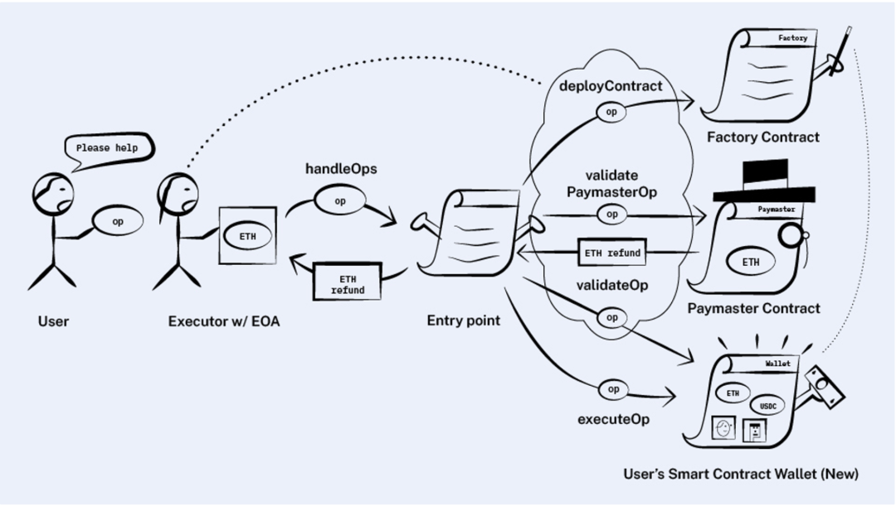

# account abstract

## 执行交易
* 通过EOA账户执行交易
  * 操作简单直接，链协议层就可以支持，交易由EOA账户私钥签名授权
  * 需要EOA账户支付ETH作为gas
  * 不能在同一个交易中调用多个合约，增加了dapp交互的复杂性

用户操作被打包为User Operation，EOA账户以User Operation作为参数来调用用户智能合约钱包。智能合约钱包对用户操作进行授权验证，执行用户的操作，抽象来看，用户操作(或者称为交易)就由这个合约执行了，这个合约就是用户的智能合约钱包。

* 通过合约账户执行交易
  * 可以执行复杂的交易，在一个用户操作中调用多个合约，如在一个用户操作中进行erc20 approve和dex swap，可以屏蔽dapp交互的复杂性
  * 交易的授权可以自定义，可以自定义签名算法或者授权方式，自定义用户操作验证规则
  * 通过合约账户执行交易，合约账户不需要支付交易的ETH gas，由交易的EOA账户支付gas

* 问题
  * EOA账户以User Operation作为参数来调用用户智能合约钱包，那么User Operation需要指定用户智能合约钱包地址，同时用户需要将User Operation广播出来，这时EOA账户构建调用合约交易并发送到ethereum上，User Operation如何广播出来？广播后，哪个EOA账户会来执行呢？EOA账户为什么愿意支付gas来执行用户操作呢？
  * 用户将User Operation发送到一个mempool，mempool中包含多个用户的多个操作，mempool如何设计，是否public，是否去中心化？是否存在多个mempool，用户如何选择发送到哪个mempool？
  * mempool服务由bundlers提供，接收用户操作，验证用户操作，将mempool中的多个用户的多个操作打包为ethereum交易，发送到ethereum。bundlers发送交易到ethereum链上，需要支付gas，这部分费用需要从用户收取，该如何收取？各个User Operation是由各个用户的智能合约钱包来执行的，要么bundlers为每个User Operation构建一个ethereum交易(调用用户的智能合约钱包)，或者bundlers构建一个ethereum交易，调用一个entry point合约，entry point合约根据User Operation调用用户的智能合约钱包。如果User Operation包含在一个ethereum交易中，该如何排序这个ethereum交易中的User Operation呢？
  * 如果将多个用户的多个操作打包在一个ethereum交易中发送到链上，如果有User Operation执行失败该如何处理？
  * 用户操作最终发送到用户智能合约钱包执行，该如何验证用户操作呢？不是任何人请求的User Operation都可以在用户智能合约钱包上执行。
  * 用户智能合约钱包又该是什么样的？用户如何创建这个智能合约钱包？用户要创建一个什么样的智能合约钱包？这需要一个智能合约钱包市场，用户选择要创建一个什么样的智能合约钱包。

## EIP4337技术解读

### 用户操作UserOperation
* sender，执行用户操作的用户智能合约钱包地址
* nonce，重放攻击保护
* initCode，如果是创建用户智能合约钱包，则是用户智能合约钱包的合约code，如果是执行用户操作，则不需要填写
* callData，用户智能合约钱包调用的dapp参数
* callGasLimit，用户操作执行的gas limit
* verificationGasLimit，用户操作验证的gas limit
* preVerificationGas，用户操作验证前的gas limit
* maxFeePerGas & maxPriorityFeePerGas，用于愿意为其用户操作支付的gas price，用户操作的竞价
* paymasterAndData，用户操作请求代付gas的服务
* signature，用户操作的签名

### Bundlers
* Bundlers接收用户操作，验证User Operation。使用EOA账户构造一个ethereum交易包含mempool中的User Operations。在用户智能合约钱包上验证和执行用户操作。Bundlers支付了gas来执行用户操作，用户需要为用户操作支付一定的fee给bundlers。
* 用户不再需要EOA账户就可以执行User Operation，不再需要管理nonce，不再需要管理EOA账户
* Bundlers可以选择&排序用户操作
* Bundlers在接收User Operation之前需要验证，需要验证授权和fee
* Bundlers是否permissionless，如果有多个Bundlers，用户该如何选择？如果Bundlers的mempool是公有的，如何确保不同的Bundler不会重复打包用户操作到ethereum交易中？
* 用户如何支付fee给bundlers?

### EntryPoint Contract
* 全局单例合约，Bundlers打包用户操作的交易首先调用EntryPoint合约，EntryPoint合约根据用户操作调用对应的用户智能合约钱包，是Bundlers和用户智能合约钱包之间的中间人
* handleOp函数以User Operations作为输入参数
* handleOp函数验证User Operations，验证User Operation的授权，是否有足够的fee来支付给Bundler
* handleOp函数调用用户操作中指定的智能合约钱包，calldata作为参数
* 智能合约钱包需要向EntryPoint合约存入token用来支付fee给Bundlers
* 智能合约钱包也可以使用自己的账户来支付fee给Bundlers，也可以请求代付合约（Paymaster)代为支付
* 用户操作可能会失败，无论是否成功，EntryPoint合约都将支付fee给Bundler，fee如何计算？
* EntryPoint提供了deposit和withdraw token的接口

### 智能合约钱包接口
* 用户操作的验证和执行分离
* 用户操作验证用在两个地方：Bundler在收到用户操作后做验证 & EntryPoint合约在执行用户操作前执行用户操作验证

### 代付合约(Paymaster)
* 用户操作的参数paymasterAndData参数指定了代付gas的合约地址和参数
* Paymaster合约需要在EntryPoint合约存入ETH用于为用户代付ETH gas
* Paymaster合约的validatePaymasterOp确保用户智能合约钱包需要支付fee
* Paymaster合约如何计算fee以及如何收取fee？

### 钱包市场
* 用户发起用户操作来创建一个智能合约钱包，无需额外的EOA账户来创建
* 用户在钱包市场选择wallet来创建

### 签名聚合器
* 不同用户智能合约钱包使用的签名算法不同，可以将使用相同签名算法的用户操作聚合起来分别验证
* 支付聚合的签名算法可以由bundlers链下集合签名，然后构建ethereum交易，在签名聚合器中验证
* 签名聚合器可以将多个用户操作和签名作为输入，输出一个聚合签名，bundler使用
* 签名聚合器将多个用户操作和聚合签名作为输入，对所有的用户操作验签，链上验证用户操作使用

### EIP4337整体工作流程
EIP4337的模块化设计将智能合约钱包的账户抽象功能分为多个接口。这些接口的功能合在一起可以总结为如下的工作流程：

* 用户向Bundler发送UserOperation
* 如果UserOperation填写了initCode参数，Bundler会触发Wallet Factory来创建有确定地址的新钱包
* 如果UserOperation填写了paymasterAndData参数，Bundler会收取Paymaster在入口点合约上质押的以太坊来支付gas。如果没有填写paymasterAndData，Bundler会收取智能合约钱包在入口点合约上质押的以太坊来支付gas
* Bundler可以选择性地使用签名聚合器
* Bundler会使用validateOp、validatePaymasterOp和validateSignatures函数在链下模拟验证UserOperation，确保签名正确且UserOperation有足够的gas
* 如果链下模拟验证通过，Bundler将多个UserOperation作为输入构造ethereum交易并发送到ethereum
* EntryPoint合约将验证UserOperation
* 如果验证通过，EntryPoint合约将执行UserOperation，无论执行是否成功，都会扣除gas

## EIP4337资料
* [eip4337](https://eips.ethereum.org/EIPS/eip-4337)
* [account abstract implementation](https://github.com/eth-infinitism/account-abstraction)
* [decoding entry point contract](https://www.biconomy.io/post/decoding-entrypoint-and-useroperation-with-erc-4337-part1)
* [Invented Account Abstraction](https://www.alchemy.com/blog/account-abstraction)
* [eip4337 entry point contract](https://etherscan.io/address/0x5FF137D4b0FDCD49DcA30c7CF57E578a026d2789)
* [user operation without paymaster](https://explorer.phalcon.xyz/tx/eth/0xcdaec484cb685416b02b1f8f19cf113e826c0054a8336f497d8a93fd15ec84d4)
* [user operation with erc20 paymaster]()
* [create wallet with paymaster](https://explorer.phalcon.xyz/tx/eth/0x7a023f6c2721ba67d7f9b8b30e5d3f64857bf720049f8172e3629a55ef3b1033)

## reference
* 币安抽象账户研报[中文](https://news.marsbit.co/20230821082722042606.html) [英文](https://research.binance.com/static/pdf/a-primer-on-account-abstraction.pdf)
* [eip 4337 minimal account](https://github.com/kopy-kat/MinimalAccount#readme)
* [best account abstraction wallets](https://blog.ambire.com/best-account-abstraction-wallets/)
* [custodial & non-custodial wallets](https://blog.ambire.com/custodial-non-custodial-wallets-explained/)

## ecosystem
* 智能合约钱包是账户抽象市场中最大的参与者。为了与EIP 4337兼容，它们通常会实现自己的打包器（Bundler）、代付合约（Paymaster）、钱包工厂（Wallet Factory）和签名聚合器（Signature Aggregator）
* 这些钱包还配备了方便dApp集成钱包的SDK
* 账户抽象基础设施还包括可以发送UserOperations的客户端SDK、打包器（Bundlers）、代付合约（Paymasters）和签名聚合器（Signature Aggregator）

### 社交登录和社交恢复
* 社交登录和社交恢复在钱包合约中定义
* 守护者(Guardian)可以授权用户访问账户或者帮助用户重置账户
* 守护者可以是Web2账号也可以是邮箱地址
* 一个智能合约钱包可以有多个守护者，在创建钱包过程中或之后设置守护者，并达到一定的守护者验证阈值，例如3个守护者中的2个，以登录或恢复钱包
* 多因素认证

#### 常见的智能合约钱包守护者类型
* web2服务，钱包用户的社交媒体账户，OAuth
* 用户设备，浏览器存储或者移动端存储
* 电子邮件
* 多签名，多个EOA账户
* MPC
* SWIE
* Web3Auth

#### 实现
* Web3Auth是许多高流量智能合约钱包使用的社交登录和MPC服务，这些钱包包括Biconomy、Etherspot和0xPass。Web3Auth把用户密钥分割成多份给社交登录、用户设备和其MPC节点网络等守护者。产品逻辑实现完全在链下，且没有任何一个守护者会存储完整的私钥。如何应用进行社交登录和社交恢复？
* BLS Wallet、Argent、ambire wallet使用多签技术（multisig）通过用户指定的多个EOA地址进行密钥恢复。
* UniPass实现了一种创新的方法，通过电子邮件进行社交恢复。用户在链上提交守护者的邮箱，并通过智能合约在链上验证邮箱的DKIM签名。
* Soul Wallet在链上验证守护者的邮箱地址以进行社交恢复。

### paymaster
* Biconomy实现了与EIP 4337兼容的Paymaster

### 法币出入金通道
* Biconomy和0xPass与Transak合作提供法币通道
* Argent与Moonpay、Transak和Wyre合作提供法币通道，并具有内置的DeFi协议聚合器
* UniPass和Braavos支持法币通道、swap

### 钱包市场
* 智能合约钱包相对于EOA的一个主要优势是其模块化设计
* 钱包的功能可以通过钱包提供商开发的合约模块进行扩展，这些模块提供了EIP 4337接口中未定义的功能，并可以由用户自定义
* 模块化设计下，智能合约钱包是可升级的

#### 钱包功能扩展
* 支出限制：限制有签名权限的帐户可以从钱包中提取的金额
* 定期打款：根据自定义时间自动打款
* 角色和授权：为钱包不同的交易和行为定义所需的角色和授权
* 组织权限：基于组织内不同角色的权限设置
* 白名单和黑名单

另一种扩展智能合约钱包功能的方法是在钱包里原生地集成去中心化应用（dApps）。例如，Gnosis Safe为dApps提供了一个SDK。使用此SDK的dApp可以直接出现在钱包界面中，等同于为钱包提供了一个内置的应用商店

## 市场参与者

### Unipass Wallet

#### reference
* [unipass](https://github.com/UniPassID/)

#### 使用
* [login](https://wallet.unipass.id/?forceLogin=0)
* [create wallet](https://polygonscan.com/tx/0x7b94a266e591bf0369b17cdde5cd78f45087f2615651448057bd651702db022d)

### ambire wallet

#### 用户交互
* sign up: 会有两个key产生，一个在客户端，使用用户email/password和额外的seed作为entropy来生成key，由用户持有。还有一个在ambire的后端生成，由ambire持有，用户可以下载。
* 发送交易: 两个key都需要对用户操作签名，ambire的后端会自动签名
* 恢复账户: 如果只有一个key签名用户操作，则为恢复账户操作，会有3天的lock，之后会重置账户

#### 探讨
* 用户的key丢失或者泄漏，可以通过恢复账户拿回权限，如果ambire不可用，用户可以拿回权限，ambire无法窃取账户资产
* 如果用户key丢失想拿回权限，这时，ambire是可以作恶的，它可以发起恶意的恢复账户操作从而控制账户，或者阻止用户恢复账户
* 客户端存在key，用户照样需要保存助记词或者私钥
* 恢复账户需要3天的lock

#### reference
* [Ambire Wallet security model](https://gist.github.com/Ivshti/fe86f13c3adff3404a1f5ce1e364304c)
* [Ambire wallet whitepaper](https://ambire.notion.site/ambire/Ambire-Wallet-Whitepaper-d502e54caf584fe7a67f9b0a018cd10f)
* [Ambier wallet DKIM](https://github.com/AmbireTech/adex-protocol-eth/issues/87)

### Stackup
Stackup是一个Bundler和Paymaster的提供商。其Bundler采用Go语言实现，通过了所有EIP 4377测试套件的要求，完全开源且免费使用。

Stackup Bundler支持不同的模式：

* 私有模式（private mode）：UserOperations进入一个私有内存池（mempool），以更慢的交易执行速度换取更好的隐私。UserOperation不会显示在公共内存池中，从而避免了MEV攻击。
* 搜索模式（searcher mode）：由以太坊生态的机器人运营者（即bot operator，也称为searcher，例如DeFi套利机器人）使用，并与诸如Flashbot之类的区块构建者（block builder）集成，通过MEV-Boost发送UserOperations，允许searcher为特定的交易排序出价，以供block builder选取MEV最大的交易排序构建区块。

Stackup还支持两种类型的Paymaster：

* Verification Paymaster：提供需要链下交易（如法币出入金）的gas抽象。例如，用户可以选择使用信用卡订阅Paymaster服务来支付gas费。用户也可以定制gas代付的逻辑。Stackup将通过“按需付费”（pay as you go）模式向用户收费。
* Deposit Paymaster：允许用户用ERC20代币支付gas费。

### Blocknative
Blocknative主要是一个内存池浏览器和可视化工具提供商。得益于其对于内存池较强的理解，Blocknative提供了具有独特功能的打包器（Bundler）服务。

* 使用EIP 4337交易浏览器（[EIP 4337 UserOps Explorer](https://explorer.blocknative.com/?v=1.36.14&0=ethereum&1=goerli&s=%7B%22name%22%3A%224337+Entry+Point%22%2C%22address%22%3A%220x0576a174d229e3cfa37253523e645a78a0c91b57%22%7D)）可视化内存池中UserOperations的状态，方便钱包和dApp实时监控交易的状态
* Blocknative的核心产品内存池浏览器也可以监听入口点合约中待处理和已确认的Bundler交易

### eth-infinitism
* eth-infinitism是以太坊基金会的官方团队，目前已经实现了EIP 4337标准定义的Bundler和Paymaster [source](https://github.com/eth-infinitism)

## 未来之路

### 技术实现细节
* 目前Bundler主要在私有内存池（private mempool）广播交易，UserOperation被直接发送给指定的区块构建者（block builder）。Bundler网络是否有可能使用公共内存池（public mempool）？
* Bundler能否通过对UserOperations进行排序来抽取MEV？区块构建者能否通过对捆绑交易（bundle）进行排序来抽取MEV？MEV将如何在Bundler和区块构建者之间分配？我们是否应该将Bundler和区块构建者分开？
* 考虑到Bundler需要完成大量的链下模拟和链上验证，它们能否同时作为可靠的区块构建者？
* UserOperation的内存池和常规交易的内存池应该如何协调以避免状态冲突？

### 优秀的Bundler？
* 确保UserOperation可以成功执行。技术难点包括理解多个UserOperations之间可能出现的状态冲突（state conflict）
* 处理验证函数对某些OpCode的禁用
  * 由于读取可变的外部状态（external state）可能导致交易验证成功但执行失败，因此EIP 4337禁止验证函数调用读取外部状态的OpCodes。 
  * 不同的L2对读取外部状态的OpCode有略微不同的禁用，会对多链开发造成挑战。 
  * 正在构建Bundler的项目方需要通过traceCall函数来获取每个函数调用的OpCodes。然而，大多数第三方RPC节点都不支持traceCall，因此Bundler项目方可能需要运行自己的节点，这也存在技术壁垒。
* 目前大多数Bundler项目方的开发重点都在L2，需要分别计算L1和L2的gas费。
* 实现私有和公共内存池的P2P network。

### 未来
* 许多打包器（Bundler）、代付合约（Paymaster）和签名聚合器（Signature Aggregator）提供商会在一个开放市场上竞争。用户可以用最低费用获取高质量服务
* 市场上既存在无需许可的Bundler、Paymaster和Signature Aggregator公共端点，也存在专门为某个智能合约钱包或dApp部署的端点
* 智能合约钱包、dApp和个人用户可以以无需许可（permissionless）、模块化（modular）和用户友好的方式部署上述的基础设施
* 可以集成到Paymaster的法币出入金聚合器和DeFi聚合器
* sdk和脚手架
  * 支持账户抽象功能的类似于ether.js的dApp开发标准库，比如对如下功能的封装： 
    * 使用Web2社交媒体账户和电子邮件创建钱包和恢复钱包地址 
    * UserOperations的创建、签名、发送以及的事件监听 
    * 快速部署Paymaster和Signature Aggregator
  * 聚合所有主要智能合约钱包的SDK和UI工具 
  * 用于快速前端部署的脚手架工具，以便dApp开发人员可以专注于他们产品的业务逻辑