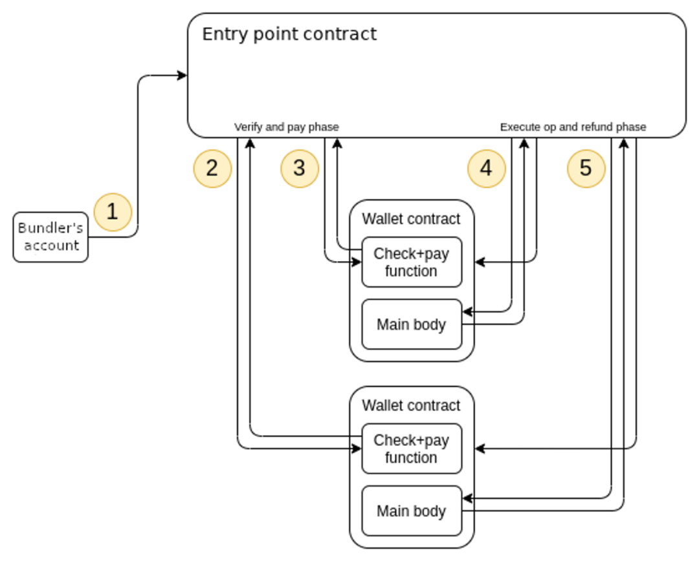
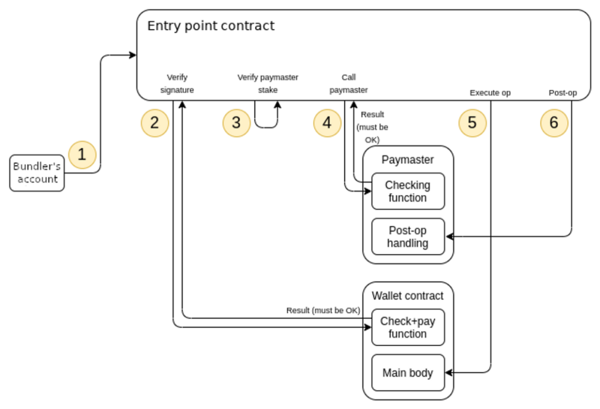

# account abstract

* ambier wallet
* safe

## 执行交易
* 通过EOA账户执行交易
  * 操作简单直接，链协议层就可以支持，交易由EOA账户私钥签名授权
  * 需要EOA账户支付ETH作为gas
  * 不能在同一个交易中调用多个合约，增加了dapp交互的复杂性

EOA账户以用户的操作作为参数来调用一个合约，然后这个合约执行操作验证，执行指定的操作。用户的操作(或者称为交易)就由这个合约执行了，这个合约就是用户的智能合约钱包。

* 通过合约账户执行交易
  * 合约账户是代码控制的，可以执行复杂的交易，可以在一个操作中调用多个合约，可以屏蔽dapp交互的复杂性
  * 合约账户是代码控制的，交易的授权可以自定义，可以自定义签名算法
  * 合约账户是代码控制的，可以自定义交易验证的规则
  * 通过合约账户执行交易，合约账户不需要支付ETH gas，由交易的EOA账户支付gas

* 这里面临的问题
  * 用户操作将作为合约参数是由一个EOA账户调用用户智能合约钱包来执行的，用户操作需要指定用户智能合约钱包地址，用户需要将用户操作发送出来，EOA账户构建调用合约交易并发送到ethereum上，那么如何发送出来？发送出来后，会由哪个EOA账户来执行呢？EOA账户为什么会支付gas来执行用户操作呢？
  * 用户需要将用户操作发送到一个mempool，mempool中包含多个用户的多个操作，mempool如何设计，是否public，是否去中心化？是否存在多个mempool，用户如何选择发送到哪个mempool？
  * bundlers提供mempool服务，接收用户操作，验证用户操作，将mempool中的多个用户的多个操作打包为ethereum交易，发送到链上。bundlers发送交易到ethereum链上，需要支付gas，这部分费用需要从用户收取，该如何收取？各个用户的操作是由各个用户的智能合约钱包来执行的，要么bundlers为每个用户的操作构建一个ethereum交易(调用用户的智能合约钱包)，或者bundlers构建一个ethereum交易，调用一个entry point合约，合约根据用户操作调用用户的智能合约钱包。如何排序这个ethereum交易中的用户操作呢？
  * 如果将多个用户的多个操作打包在一个ethereum交易中发送到链上，如果由用户的交易执行失败该如何处理？
  * 用户操作最终发送到用户智能合约执行，该如何验证用户操作呢？不是任何人的操作都可以发送到用户智能合约上去执行。
  * 用户智能合约钱包又该是什么样的？用户如何创建这个智能合约钱包？用户要创建一个什么样的智能合约钱包？这需要一个智能合约钱包市场，用户选择要创建一个什么样的智能合约钱包。

## EIP4337技术解读

### 用户操作UserOperation
* sender，执行用户操作的用户智能合约钱包地址
* nonce，重放攻击
* initCode，如果是创建用户智能合约钱包，则是用户智能合约钱包的合约code，如果是执行用户操作，则不需要填写
* callData，用户智能合约钱包调用的dapp参数
* callGasLimit，用户操作执行的gas limit
* verificationGasLimit，用户操作验证的gas limit
* preVerificationGas，用户操作验证前的gas limit
* maxFeePerGas & maxPriorityFeePerGas，用于愿意为其用户操作支付的gas price，用户操作的竞价
* paymasterAndData，用户操作请求代付gas的服务
* signature，用户操作的签名

### Bundlers
* Bundlers接收用户操作，使用EOA账户构造ethereum交易，在用户智能合约钱包上验证和执行用户操作。Bundlers支付了gas来执行用户操作，因为用户为用户操作支付一定的fee给bundlers。
* 用户不再需要EOA账户就可以执行用户操作
* Bundlers可以选择&排序用户操作
* Bundlers需要验证用户操作，才能接收用户操作，需要验证授权和fee
* Bundler是否permissionless，如果有多个Bundlers，用户该如何选择？如果Bundlers的mempool是公有的，如何确保不同的Bundler不会重复打包用户操作到ethereum交易中？

### EntryPoint Contract
* 全局单例合约，Bundlers打包用户操作的交易首先调用EntryPoint合约，EntryPoint合约根据用户操作调用对应的用户智能合约钱包，是Bundlers和用户智能合约钱包之间的中间人
* handleOp函数接受用户操作作为输入参数
* handleOp函数验证用户操作，检查是否有指定的智能合约钱包地址签名，是否有足够的fee来支付给Bundler
* handleOp函数调用用户操作中指定的智能合约钱包，calldata作为参数
* 智能合约钱包需要向EntryPoint合约存入token用来支付fee给Bundlers
* 智能合约钱包也可以使用自己的账户来支付fee给Bundlers，也可以请求代付合约（Paymaster)代为支付
* 用户操作可能会失败，无论是否成功，EntryPoint合约都将支付fee给Bundler，fee如何计算？
* EntryPoint提供了deposit和withdraw token的接口

### 智能合约钱包接口
* 用户操作的验证和执行分离
* 用户操作验证用在两个地方：Bundler在收到用户操作后做验证 & EntryPoint合约在执行用户操作前执行用户操作验证

### 代付合约(Paymaster)
* 用户操作的参数paymasterAndData参数指定了代付gas的合约地址和参数
* Paymaster合约需要在EntryPoint合约存入ETH用于为用户代付ETH gas
* Paymaster合约的validatePaymasterOp确保用户智能合约钱包需要支付fee
* Paymaster合约如何计算fee以及如何收取fee？

### 钱包市场
* 用户发起用户操作来创建一个智能合约钱包，无需额外的EOA账户来创建
* 用户在钱包市场选择wallet来创建

### 签名聚合器
* 不同用户智能合约钱包使用的签名算法不同，可以将使用相同签名算法的用户操作聚合起来分别验证
* 支付聚合的签名算法可以由bundlers链下集合签名，然后构建ethereum交易，在签名聚合器中验证
* 签名聚合器可以将多个用户操作和签名作为输入，输出一个聚合签名，bundler使用
* 签名聚合器将多个用户操作和聚合签名作为输入，对所有的用户操作验签，链上验证用户操作使用

## reference
 * 币安抽象账户研报[中文](https://news.marsbit.co/20230821082722042606.html) [英文](https://research.binance.com/static/pdf/a-primer-on-account-abstraction.pdf)
 * [eip4337](https://eips.ethereum.org/EIPS/eip-4337)