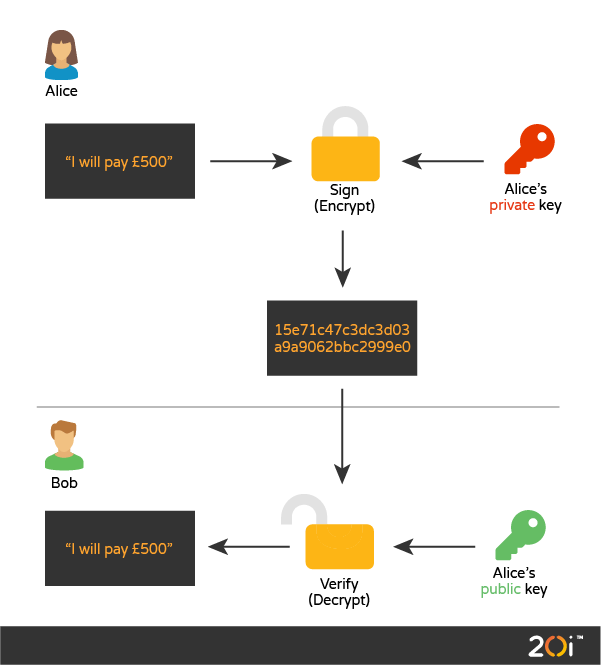
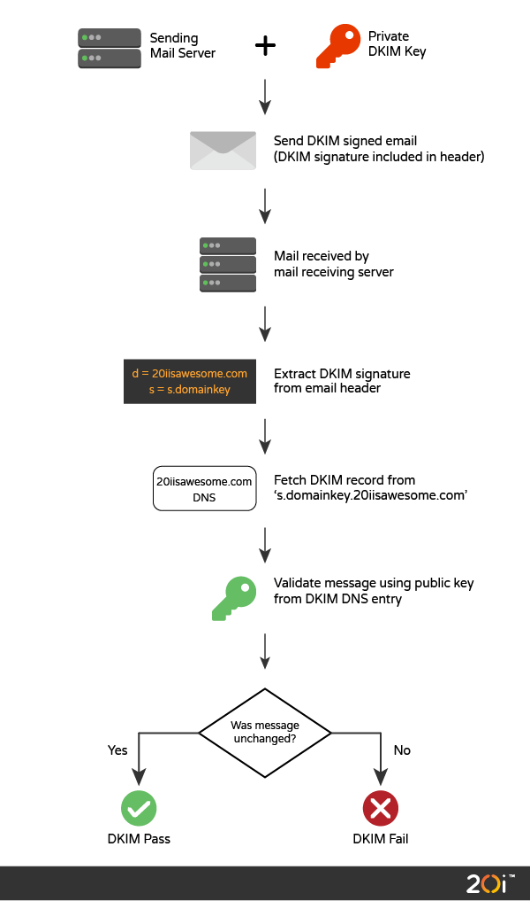

# DKIM

## DKIM
* DKIM签名是由sender的邮件服务器使用私钥生成
* receiver的邮件服务器通过DNS查询获取公钥来验证签名


## How works


### 签名
* sender的邮件服务器负责生成签名，sender的签名私钥由邮件服务器保存
* 生成message header和message body的hash，对hash签名
* DKIM签名作为一个special email header

### 验签
* receiver的邮件服务器负责验签
* 从DNS获取sender的public key
* 有了public key和带DKIM签名的邮件，邮件服务器执行验签

## DKIM签名
```
DKIM-Signature: v=1; a=rsa-sha256; q=dns/txt; c=relaxed/relaxed;
 d=20iisawesome.co.uk; s=s1; h=Message-ID:Subject:To:From:Date:Content-Type:
 MIME-Version:Sender:Reply-To:Cc:Content-Transfer-Encoding:Content-ID:
 Content-Description:Resent-Date:Resent-From:Resent-Sender:Resent-To:Resent-Cc
 :Resent-Message-ID:In-Reply-To:References:List-Id:List-Help:List-Unsubscribe:
 List-Subscribe:List-Post:List-Owner:List-Archive;
 bh=3zHAZOM3ZC2Xnw6cIsUoqMayPLB+3ctDAb0TU/ZVneE=; i=@20iisawesome.co.uk;
 t=1572341960; x=1572428360;
 b=WkWIVcElG0eCkeAXG+eT6Tq+eAZgOvg9PL422L82/ETTsJd
 hnywMKnzKiVckU4d2OfKjEFhK4ctoPhubXv72iDSwJPatCRSutCFjgO4q0G/fO1YDCuOnnWlcZZxs
 gcVBXWIOQfVlvRFTDDyy+HMk2YdgG6SX+2O/GOGoZTdBaWZ/cs3GnNLUXu1hDmRukl0YEWbX6uvad
 G1kxBkLUQodeaqhxo9/Bt+GI1/LNqoPgaPM2R4K53uztI/GM9TZlfGjB31tBuAvsNEjuJyQgwh68p
 ZIQrU3eByl0ocdoiOIduxWn9aTTIbtNs19EwBsN2KfV3XbDW205p5Pun2FBzuVhA==;
```
* DKIM-Signature: 邮件header name
* v=1 : DKIM协议版本
* a=rsa-sha256 : message的hash算法
* q=dns/txt : 查询sender的public key的方式
* relaxed/relaxed : 是否允许修改邮件原内容，simple不允许任何修改，relaxed允许对空白换行修改
* d=20iisawesome.co.uk : 邮件域名
* s=s1 : sender key selector, sender可能有多个key
* h=Message-ID:...... : 邮件header字段
* bh=3zHAZOM3ZC2Xnw6cIsUoqMayPLB+3ctDAb0TU/ZVneE= : message的hash
* t=1572341960 : 签名时间
* x=1572428360 : 签名过期时间
* b=WkWIVcElG0eCkeAXG+eT6Tq+eAZgOvg9PL422L82/ETTsJd...... : 签名

## reference
* [DKIM explainer](https://www.20i.com/blog/dkim-demystified/)
* [DKIM SPEC](http://dkim.org/specs/rfc4871-dkimbase.html)