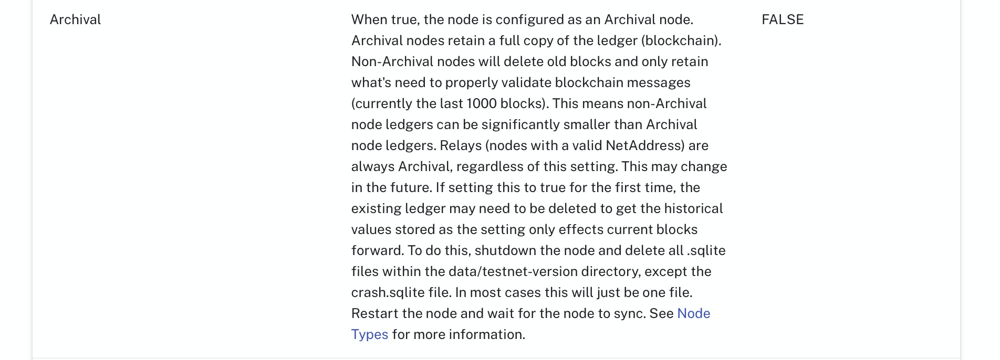

# Algorand节点

两种类型的节点：relay node（中继节点、非参选节点）和non-relay node（非中继节点、参选节点）。

两种模式：非全节点和全节点（archival mode）。

## relay node

1. 一般不参与共识
2. 通信路由，向其他relay node或者non-relay node转发消息（block，transaction，）

## non-relay node

1. 参与共识
2. 连接relay node参与网络选举

non-relay节点默认情况下是非全节点，仅仅保存有限数量的区块（最大是最近的1000个）。

优点：
1. 降低节点对磁盘空间的要求。
2. 可以参与共识。
3. 可以向节点发送交易。

缺点：
1. 老的block不可用。

将non-relay节点的archival设置为true可以开启为全节点模式。而relay node总是为全节点模式。

