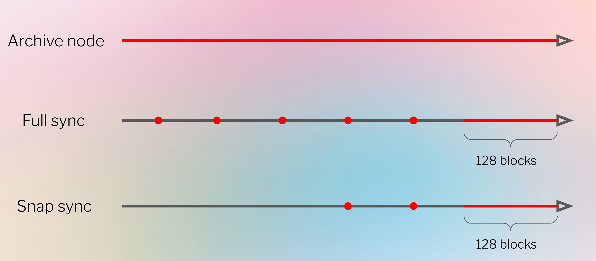

# ETH Transfer Trace

## 从链上获取transfer信息
* erc20 transfer : event(contract, topics, data) [transaction example](https://etherscan.io/tx/0xba6cdf30015e7a5a9a3ccc16ac36863bd664ee19463d2bfd4fff4054e0c280f9)
* ETH transfer by EOA: raw transaction(from, to, value) [transaction example](https://etherscan.io/tx/0xc40632d9e5d7e82f1155a62e48dfb7fb8b9ec71acc5a0adb788eba5aeb3309fd)
* ETH transfer by contract: 没有event，也无法通过raw transaction知道，how to? [transaction example](https://etherscan.io/tx/0x46c65f3b696e13a2867db79273e48740c92b1a89230ba0083b8b88a39cd9b074)

## EVM tracing
* ethereum有两种不同的transaction：
  * value transfer，很好知道其做了什么
  * 合约交易，很难知道做了什么
* EVM trace通过re-running locally来收集需要的数据，侦测其做了什么

## ethereum节点同步、状态&trace原理

### ethereum节点同步

### trace执行
* 确定交易的parent block
* 获取状态
  * 从parent block开始向前找到最近可用的状态
  * 重新执行最近可用状态到parent block区间的所有交易来恢复parent block位置的状态
* 重新执行trace交易，收集数据

### 工具
* debug_getAccessibleStates
* --gcmode archive 节点可以带这个参数启动，这样节点可以缓存很多block状态

## trace的类型

### basic trace
* 收集EVM执行的每个opcode的所有信息
* debug_traceTransaction，指定txhash参数
* 返回所有opcode信息，数据量很大

### built-in trace
* 收集指定tracer的执行信息
* debug_traceTransaction，指定txhash和tracer
* tracer: callTracer, 4byteTracer, prestateTracer

### custom trace
* 收集符合用户指定参数的执行信息
* 需要修改geth客户端，修改EVM执行数据收集方式

## 通过EVM trace获取internal transaction
* 通过指定callTracer来获取callFrame
* callFrame包含有from、to、value等信息，可以获取到internal transaction
* 合约transfer ETH，也有一个callFrame，from、to、value就是ETH transfer信息
