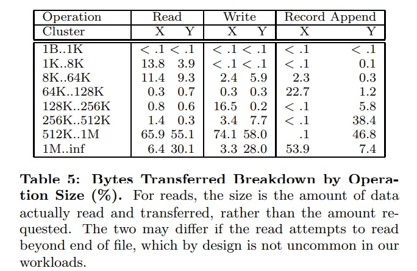
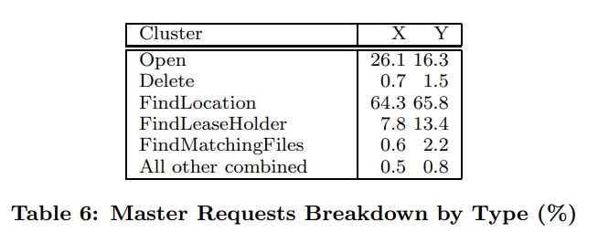

# The Google File System 中文版
 

## 摘要
我们设计并实现了Google文件系统，一个面向分布式数据密集型应用的、可伸缩的分布式文件系统。虽然运行在廉价的日用硬件设备上，但是它依然了提供容错功能，为大量客户机提供了很高的总体性能。

虽然与很多之前的分布式文件系统有很多相同目标，但是，我们的设计已经受应用的负载情况和技术环境影响，现在以及可预见的将来都反映出，我们的设计和早期的分布式文件系统的设想有了显著的分离。这让我们重新审视了传统文件系统在设计上的选择，探索彻底不同的设计点。

GFS成功满足了我们的存储需求。其作为存储平台被广泛的部署在Google内部，该平台用来产生和处理数据，这些数据被我们的服务以及需要大规模数据集的研究和开发工作使用。迄今为止，最大的一个集群利用一千多台机器上的数千个硬盘，提供数百TB的存储空间，同时被数百个客户机访问。

在本论文中，我们展示了设计用来支持分布式应用的文件系统接口的扩展，讨论我们设计的许多方面，最后对小规模基准测试和真实使用作了测量报告。

## 常用术语
设计，可靠性，性能，测量

## 关键词
容错，可伸缩性，数据存储，集群存储

## 1.     简介
为了满足Google迅速增长的数据处理需求，我们设计并实现了Google文件系统(Google File System–GFS)。GFS与之前的分布式文件系统有着很多相同的目标，比如，性能、扩展性、可靠性以及可用性。但是，我们的设计还受对我们的应用的负载和技术环境的观察的影响，现在以及可预见的将来都反映出，我们的设计和早期的分布式文件系统的设想有了显著的分离。这让我们重新审视了传统文件系统在设计上的选择，在设计上探索了彻底不同的设计点。

首先，组件失效被认为是常态事件，而不是意外事件。文件系统由几百乃至数千台由廉价的日常部件组装成的存储机器组成，同时被相当数量的客户机访问。部件的数量和质量事实保证了任意给定时间，一些部件无法工作，一些部件无法从它们目前的失效状态中恢复。我们遇到过如下原因导致的问题，比如应用程序bug、操作系统的bug、人为失误，甚至还有硬盘、内存、连接器、网络以及电源失效。因此，持久的监控、错误侦测、容错以及自动恢复必须集成在系统中。

其次，以传统的标准衡量，我们的文件非常巨大。数GB的文件非常普遍。每个文件通常包含许多应用程序对象，比如web文档。当我们定期由数亿个对象构成的快速增长的数TB的数据集时，即使文件系统支持，管理数十亿KB大小的小文件也是不实用的。因此，设计的假设条件和参数，比如I/O 操作和Block的尺寸都不得不重新考虑。

第三，绝大部分文件的变更是采用在追加新数据，而不是重写原有数据的方式。文件内部的随机写在实际中几乎不存在。一旦写完之后，文件只能读，而且通常只能顺序读。各种数据符合这些特性，比如：一些可能组成了数据分析程序扫描的超大数据集；一些可能是正在运行的应用程序生成的连续数据流；一些可能是档案数据；一些可能是由一台机器生成、另外一台机器处理的中间数据，同时处理或者稍后适时处理。考虑到这种针对海量文件的访问模式，数据的追加是性能优化和原子性保证的焦点所在，客户端对数据块缓存毫无吸引力。

第四，通过增加灵活性，应用程序和文件系统API的协同设计对整个系统有益。比如，我们放松了对GFS一致性模型的要求，不用在应用程序中强加繁重负担，大大简化了文件系统。我们甚至引入了原子性的追加操作，这样多个客户端可以对一个文件同时进行追加操作，不需要他俩之间额外的同步机制。这些问题会在下文进行详细讨论。

当前针对不同目的部署了多重GFS集群。最大的一个集群拥有超过1000个存储节点，超过300TB的硬盘存储，被不同机器上的数百个客户端连续不断的频繁访问。

## 2.设计概述
### 2.1 假设
在设计满足我们需求的文件系统时候，我们被这种现实指引着：我们的假设既有机遇、又有挑战。我们之前提到一些关键关注点，现在更详细地展示我们的假设。

系统由许多廉价的日用组件组成，组件失效是一种常态。系统必须持续监控自身状态，探测，处理容错并且迅速地恢复失效的组件。

系统存储一定数量的大文件。我们预期会有几百万个文件，文件的大小通常在100MB或者以上。数个GB大小的文件也是普遍存在，并且应该被被有效的管理。系统也必须支持小文件，但是不需要针对小文件做优化。

系统的工作负载主要由两种读操作组成：大规模的流式读取和小规模的随机读取。大规模的流式读取中，单次操作通常读取数百KB的数据，更常见的是一次读取1MB甚至更多的数据。来自同一个客户机的连续操作通常是读取一个文件中一个连续区域。小规模的随机读取通常是在任意位移上读取几个KB数据。对性能敏感的应用程序通常把小规模的随机读取分批处理并排序，如此在文件中稳固前进而不是往复来去。

系统的工作负载还包括许多大规模的、顺序的、对文件追加数据的写操作。通常操作的大小和读操作类似。数据一旦被写入后，文件很少被再次变更。系统支持在文件任意位置写入的小型操作，但是这种操作不必高效。

系统必须高效的、定义明确的（alex注：well-defined）实现多客户端并行追加数据到同一个文件里的语意。我们的文件通常作为“生产者-消费者”队列，或者为多路合并使用。数百个生产者，每台机器上运行一个，并发地对一个文件进行追加。最小同步开销原子性是必要的。文件可以在稍后读取，或者是消费者在追加同时读取文件。

高可持续的网络带宽比低延迟更重要。我们的大多数目标程序很看重高速率大批量地处理数据，极少有程序对单一的读写操作有严格的响应时间要求。

### 2.2 接口
GFS 提供了一套常见的文件系统接口，尽管它没有实现像POSIX的一套标准API。文件以目录的形式分层组织，用路径名标识。我们支持常用的操作，如创建、删除、打开、关闭、读写文件。

另外，GFS 有快照和记录追加操作。快照以很低的成本创建一个文件或者目录树的拷贝。记录追加操作允许多个客户端同时对一个文件进行追加，同时保证每个单一客户端追加的原子性。多个客户端可以在不需要额外锁的情况下，同时追加数据，这对于实现多路结果合并，以及”生产者-消费者”队列非常有用。我们发现这些类型的文件对于构建大型分布应用是非常重要的。快照和记录追加操作将在3.4和3.3节分别作进一步讨论。

### 2.3 架构
一个GFS 集群包含一个单独的master（alex注：这里的一个单独的master节点的含义是GFS系统中只存在一个逻辑上的master组件。后面我们还会提到master节点复制，因此，为了理解方便，我们把master节点视为一个逻辑上的概念，一个逻辑的master节点包括两台物理主机，即两台master服务器）和多台chunkserver，并且被多个客户端访问，如图1 所示。其中的每台机器通常都是运行着用户级别(user-level)的服务器进程的日常Linux机器。我们可以很容易地把chunk服务器和客户端都运行在同一台机器上，前提是机器资源允许，并且运行古怪应用程序代码而引起的不可靠性是可以接受的。

 

文件都被分割成固定大小的块。在创建块的时候，master会对每个块分配一个不可变的、全球唯一的64位的块句柄来进行标识。Chunkserver将块作为linux 文件保存在本地硬盘上，并且根据指定的块句柄和字节范围来读写块数据。为了可靠，每个块都会复制到多个chunkserver上。缺省情况下，我们存储三个副本，不过用户可以为不同的文件命名空间区域指定不同的复制级别。

Master维护所有的文件系统元数据。这些元数据包括命名空间、访问控制信息、文件到块的映射信息、以及当前块的位置。Master节点还控制着系统范围内的活动，比如，块租用管理(alex注：BDB也有关于lease的描述，不知道是否相同) 、孤立块的垃圾回收、以及块在Chunkserver间的迁移。Master用心跳信息周期地和每个Chunkserver通讯，向Chunkserver发送指令并收集其状态。

链接到每个应用程序里的GFS客户端代码实现了文件系统API，代表应用程序与master和Chunkserver通讯以及读写数据。客户端和master交互元数据操作，但是所有承载数据的通信都是直接和Chunkserver进行的。我们不提供POSIX标准的API，因此不需要在Linux vnode层建立钩子程序。

无论是客户端还是Chunkserver都不需要缓存文件数据。客户端缓存收效甚微，因为大多数程序要么流式处理一个巨大文件，要么工作集太大根本无法缓存。通过消除缓存相关的问题简化了客户端和整个系统。（然而，客户端会缓存元数据。）Chunkserver不需要缓存文件数据的原因是，数据块以本地文件的方式保存，Linux 缓冲区已经把经常访问的数据缓存在了内存中。

### 2.4 单一Master节点
单一的master节点极大地简化了我们的设计。并且使master可以使用全局信息(knowledge)进行复杂的块部署和副本决策。然而，我们必须使其与读写的相关性降到最小，以避免其成为瓶颈。客户端绝不通过master读写文件数据。相反，客户端询问master它应该联系哪一个Chunkserver。客户端将这些信息缓存有限的时间，后续的操作直接和Chunkserver进行交互。

我们参考图1解释一次简单读取交互。首先，客户端使用固定的块大小将应用程序指定的文件名和字节偏移转换成文件中的块索引。然后，它将包含文件名和块索引的请求发给master。Master回复相应的块句柄和副本位置信息。客户端使用文件名和Chunk索引作为键缓存这些信息。

之后客户端发送请求到其中的一个副本处，一般是最近的。请求信息指定了Chunk句柄和块内字节范围。对同一个块的进一步读取不再需要客户端和master的交互了，知道缓存信息过期或者文件被重新打开。实际上，客户端通常会在一次请求中请求多个块，master也可能立刻包含了那些请求之后的块信息。这些额外的信息在实际上没有任何额外代价的情况下，回避了客户端和master未来一些可能的交互。

### 2.5 Chunk尺寸
块的大小是关键的设计参数之一。我们选择了64MB，这个尺寸远远大于通常文件系统的块大小。每个块副本都以普通Linux文件的形式保存在Chunkserver上，只有在需要的时候才扩大。惰性空间分配策略避免了由于内部碎片导致的空间浪费，也许这是对这么大的块尺寸最有争议的地方。

大尺寸块有几个重要的优势。首先，它减少了客户端和master交互的需求，因为对同一块的读写只需要一次和mater的初始请求来获取块的位置信息。这种缩减我们的工作负载至关重要，因为应用程序大都是连续读写大文件。即使是小规模的随机读取，客户端可以轻松地为一个数TB的工作集缓存所有的块位置信息。其次，因为采用较大块，客户端很可能对一个块执行多次操作，这样可以通过与Chunkserver在很长的时间内保持持久的TCP 连接来减少网络负载。再者，它减少了在master上保存的元数据的大小。这就允许我们把元数据保存在内存中，这也带来了其它优势，我们将在在2.6.1节进行讨论。

另一方面，即使配合惰性空间分配，大尺寸块也有其缺点。小文件包含少量的块，甚至只有一个块。如果许多客户端访问同一个小文件，存储这些块的Chunkserver就会变成热点。在实际中，由于我们的程序通常是连续的读取包含多个块的大文件，热点还不是主要问题。

然而，当GFS第一次被批处理队列系统使用的时候，热点问题还是显露了：一个可执行文件作为一个单块文件写在了GFS上，之后同时在数百台机器上启动。存放这个可执行文件的几个Chunkserver被数百个并发请求造成过载。我们通过使用更大的复制因子来保存这样的可执行文件，并且让批处理队列系统错开程序的启动时间的方法解决了这个问题。一个可能的长效解决方案是，在这种的情况下允许客户端从其它客户端读取数据（p2p?）。

### 2.6 元数据
Master（alex注：注意逻辑的master节点和物理的master服务器的区别。后续我们谈的是每个master服务器的行为，如存储、内存等等，因此我们将全部使用物理名称）存储3种主要类型的元数据：文件和块的命名空间、文件到块k的映射、每个块副本的位置。所有的元数据都保存在master的内存中。前两种类型（命名空间、文件到块的映射）同时也会通过记录变更到操作日志的方式持久存储，该日志存储在master的本地磁盘上，并且在远程机器上备份。使用日志使我们能够简单可靠地更新master的状态，并且不用冒着万一master崩溃数据不一致的风险。Master不会持久存储块位置信息。相反，Master会在启动，或者有新的Chunkserver加入集群时，向各个Chunkserver询问它们的块信息。

#### 2.6.1 内存中的数据结构
因为元数据保存在内存中，master的操作非常快。并且，Master在后台周期性扫描自己的整个状态简单高效。这种周期性的扫描用于实现块垃圾收集、在Chunkserver失效时重新备份、通过块迁移来均衡跨Chunkserver的负载及磁盘使用状况。4.3和4.4章节将进一步讨论这些行为。

对于这种memory-only式的方法的一个潜在担心在于：块的数量亦即整个系统的容量受限于master所拥有的内存大小。这在实际应用中并不是一个严重的限制。Master为每个64M数据块维护少于64个字节的元数据就。由于大多数文件包含多个块，因此大多数块是满的，除了最后一个块是部分填充的。同样，每个文件需要的文件命名空间数据通常少于64字节，因为它使用前缀压缩紧密地存储文件名字。

如果有必要支持更大的文件系统，相比于通过在内存中存储元数据而获得的简洁性、可靠性、高性能和灵活性而言，为master增加额外内存的费用也是很少的。

#### 2.6.2 Chunk 位置信息
Master不保存哪个Chunkserver拥有指定块的副本的持久化记录。Master只是在启动的时候轮询Chunkserver以获取那些信息。Master可以保持自己是最新的（thereafter），因为它控制了所有的块的部署，而且通过定期心跳信息监控Chunkserver的状态。

我们最初试图把块的位置信息持久地保存在master上，但是我们认定在启动的时候从Chunkserver请求数据，之后定期轮询更简单。这样消除了在Chunkserver加入、离开集群、更名、失效、以及重启等情况发生的时候，保持master和Chunkserver同步的问题。在一个拥有数百台服务器的集群中，这类事件会频繁的发生。

理解这个设计决策的另外一种方式就是认识到：对于块是否在它的硬盘上，Chunkserver才说了算。试图在master上维护一个这些信息的一致视图是毫无意义的，因为Chunkserver上的错误可能会导致块不由自主地消失(比如，硬盘可能损坏不能用了)，或者操作人员可能会重命名一个Chunkserver。

#### 2.6.3 操作日志
操作日志包含了关键的元数据变更历史记录。这对GFS 非常重要。不仅是因为它是元数据的唯一持久化记录，它也作为定义同步操作顺序的逻辑时间基线（alex注：也就是通过逻辑日志的序号作为操作发生的逻辑时间，类似于事务系统中的LSN）。文件和块，连同它们的版本(参考4.5节)，都由它们创建时的逻辑时间唯一的、永久的标识。

由于操作日志至关重要，我们必须对其可靠地存储，并且只有在元数据的变化被持久化后，这种变化对客户才是可见的。否则，即使块本身没有问题，我们（effectively）有效地丢失整个文件系统或者最近的客户操作。因此，我们会把日志复制到多台远程机器，并且只有把相应的日志记录写入到本地以及远程硬盘之后，才会响应客户端的操作请求。Master会在写入之前将一些日志记录分批处理，从而减少写入和备份对整体系统吞吐量的影响。

Master通过重演操作日志恢复它的文件系统状态。为了缩短启动时间，我们必须保持日志很小（alex注：即重演系统操作的日志量尽量的少）。每当日志增长到超过一定大小的时候master对系统状态做一次检查点，(shijin：Checkpoint是一种行为，一种对数据库状态作一次快照的行为，将所有的状态数据写入一个Checkpoint文件，并删除之前的日志文件)如此一来，通过从本地磁盘加载最新检查点，然后仅仅重演检查点之后有限数目日志记录的方式，master即可恢复系统。检查点是一个紧密的类B-树格式，该格式可以直接映射到内存，可以在无需额外解析的情况下用于命名空间查询。这进一步提高了恢复速度，增强了可用性。

由于创建一个检查点需要一定的时间，所以master的内部状态被组织为这样的形式，这种形式可以在不阻塞后续变更操作的同时创建新的检查点。Master在一个独立的线程切换到新的日志文件并创建新的检查点。新的检查点包含切换前所有的变更。为一个有数百万文件的集群创建一个检查点大约需要1 分钟的间。创建完成后，检查点被写入本地和远程硬盘中。

Master只需要最新的检查点和后续的日志文件。旧的检查点和日志文件可以被自主删除，但是为了提防灾难性故障（alex注：catastrophes，数据备份相关文档中经常会遇到这个词，表示一种超出预期范围的灾难性事件），我们还是会随手保存一些。创建检查点期间的失败不会影响正确性，因为恢复代码检测并跳过没完成的检查点。

### 2.7 一致性模型
GFS有一个宽松的一致性模型，这个模型很好地支撑我们的高度分布的应用，但是却依然相当简单且可以高效实现。现在我们讨论GFS的一致性保障及其对应用程序的意义。我们也强调了GFS 如何维护这些保障，但是实现的细节将在本论文的其它部分讨论。

#### 2.7.1 GFS一致性保障机制
文件命名空间的变更（例如，文件创建）是原子性的。它们只能由master控制：命名空间锁保证了原子性和正确性（4.1节）；master的操作日志定义了这些操作的一个全局完整的顺序（2.6.3节）。

 

数据变更后一个文件域（alex注：region这个词用中文非常难以表达，我认为应该是变更操作所涉及的文件中的某个范围）的状态取决于操作的类型、成功与否、以及是否有同步变更。表1 汇总了结果。如果所有客户端，无论从哪个副本读取，总是看到相同的数据，那么我们认为文件域是“一致的”；在一个文件数据变更以后，如果文件域是一致的，并且客户端能够看到变更写入的完整内容，那么这个域是“已定义的”。当一个数据变更操作成功执行，没有受到同步写操作的干扰，那么受影响的域就是已定义的（暗含了一致性）：所有的客户端总是可以看到变更写入的内容。并发变更操作成功完成之后，域处于一致的、未定义的状态：所有的客户端看到同样的数据，但是它无法反映任何一次变更写入写入的数据。通常情况下，文件域包含了来自多个变更的、混杂的数据片段。失败的变更操作导致这个域不一致（因此也是未定义的）：不同的客户可能在不同的时间会看到不同的数据。下面我们描述了我们的应用程序如何区分已定义和未定义的域。应用程序没必要进一步区分未定义域的不同类型。

数据变更可能是写入或者记录追加。写入操作把数据写在应用程序指定的文件偏移位置上。即使在并发变更面前，记录追加操作至少把数据（记录）原子性的追加一次，但是是在GFS 选择的偏移上（3.3节）（alex注：这句话有点费解，其含义是所有的追加写入都会成功，但是有可能被执行了多次，而且每次追加的文件偏移量由GFS自己计算）。（相比而言，通常的追加不过在这样一个偏移位置写，客户认为偏移位置是文件的当前的尾部。）GFS返回给客户端一个偏移量，该偏移量标明了包含了记录的、已定义的域的起点。另外，GFS 可能会在中间插入填充数据或者重复记录。它们占据被认定为不一致的域，并且这些数据和用户数据相比通常很小。

经过了一系列的成功的变更操作之后，GFS保证被变更的文件域是已定义的，并且包含最后一次变更操作写入的数据。GFS 通过以下措施达成目的：（a）  对块的所有副本应用相同顺序的变更（3.1节），（b）使用块版本号来探测过期的副本，过期的副本是由于它所在的Chunkserver宕机（4.5章）期间错过了变更而引起的。过期的副本不会涉及变更，也不会返回给向master请求块位置信息的客户端。它们优先被垃圾收集。

由于客户端缓存块位置信息，所以在信息刷新前，客户端有可能从一个失效的副本读取了数据。这个时间窗口受限于缓存条目的超时时间和文件文件下一次被打开的时间，文件的再次打开会从缓存中清除该文件的块信息。并且，鉴于我们的大多数文件都是只进行追加操作，一个失效的副本通常返回一个提前结束的块而不是过期的数据。当一个Reader（alex注：本文中将用到两个专有名词，Reader和Writer，分别表示执行GFS读取和写入操作的程序）重新尝试并联络master时，它就会立刻得到当前的块位置信息。

变更操作成功执行很长时间之后，组件的失效仍然可以损坏或者销毁数据。GFS通过master和所有Chunkserver定期“握手”的方式来识别失效的Chunkserver，并且通过检查检验和来校验数据是否损坏（5.2节）。一旦问题浮出水面，数据要从效副本快速恢复（4.3节）。只有块的所有副本在GFS作出反应前全部丢失，该块才会不可逆转的丢失。GFS的反应时间（alex注：指master节点检测到错误并采取应对措施）通常是几分钟。即使在这种情况下，块变得不可用了，而不是损坏了：应用程序会收到清晰的错误信息而不是损坏的数据。

#### 2.7.2 程序的实现
GFS 应用程序可以利用一些简单技术适应这个宽松的一致性模型，这些技术已经满足了其他目的的需要：依赖追加而不是重写，检查点，自验证，自标识的记录。

实际中，我们所有的应用通过追加而不是重写的方式变更文件。一种典型的应用中，写入程序从头到尾地生成一个文件。写完所有数据之后，程序原子性地将文件重命名为一个永久的文件名，或者定期地对成功写入了多少数据设置检查点。检查点也可以包含程序级别的检验和。Readers仅校验并处理上一个检查点之后的文件域，也就是人们知道的已定义状态。不管一致性和并发问题的话，该方法对我们很适合。追加比随机写更有效率，对程序失败有更弹性。检查点允许Writer递增地重启，并且防止Reader成功处理从应用程序的角度看来并未完成的写入的文件数据。

在另一种典型应用中。许多Writer为了合并结果或者作为生产者-消费者队列并发地向一个文件追加数据。记录追加的“至少追加一次”的语义维持了每个Writer的输出。Reader使用下面的方法来处理偶然的填充和重复。Writer准备的每条记录中都包含了类似检验和的额外信息，以便用来验证它的有效性。Reader可以用检验和识别和丢弃额外的填充数据和记录片段。如果偶尔的重复内容是不能容忍的(比如，如果这些重复数据将要触发非幂等操作)，可以用记录的唯一标识来过滤它们，这些标识符也通常用于命名相应程序实体，例如web文档。这些记录I/O功能（除了剔除重复数据）都包含在我们程序共享的代码库（library code）中，并且适用于Google内部其它的文件接口实现。这样，记录的相同序列，加上些许重复数据，总是被分发到记录Reader中。

## 3. 系统交互
我们设计这个系统力图最小化master与所有操作的牵连。在这样的背景下，我们现在描述客户机、master和Chunkserver如何交互以实现数据变更、原子记录追加以及快照功能。

### 3.1 租约（lease）和变更顺序
变更是改变块内容或者块元数据的操作，比如写操作或者追加操作。每次变更在块所有的副本上执行。我们使用租约（lease）来维护副本间的一致性变更顺序。Master向其中一个副本授权一个块租约，我们把这个副本叫做主副本。主副本为对块的所有变更选择一个序列。应用变更的时候所有副本都遵照这个顺序。这样，全局变更顺序首先由master选择的租约授权顺序规定，然后在租约内部由主副本分配的序列号规定。

设计租约机制的目的是为了最小化master的管理开销。租约的初始过期时间为60秒。然而，只要块正在变更，主副本就可以请求并且通常会得到master无限期的延长。这些延长请求和批准信息附在master和所有Chunkserver之间的定期交换的心跳消息中。Master有时可能试图在到期前取消租约（例如，当master想令一个在一个重命名的文件上进行的修改失效）。即使master和主副本失去联系，它仍然可以安全地在旧的租约到期后和向另外一个副本授权新的租约。

 在图2 中，我们根据写操作的控制流程通过这些标号步骤图示说明了这一过程。

 

+ 1．客户机询问master哪一个Chunkserver持有该块当前的租约，以及其它副本的位置。如果没有chunkserver持有租约，master将租约授权给它选择的副本（没有展示）。

+ 2．master将主副本的标识符以及其它副本（次级副本）的位置返回给客户机。客户机为将来的变更缓存这些数据。只有在主副本不可达，或者其回应它已不再持有租约的时候，客户机才需要再一次联系master。

+ 3．客户机将数据推送到所有副本。客户机可以以任意的顺序推送数据。Chunkserver将数据存储在内部LRU 缓存中，直到数据被使用或者过期。通过将数据流和控制流解耦，我们可以基于网络拓扑而不管哪个Chunksever上有主副本，通过调度昂贵的数据流来提高系统性能。3.2章节会作进一步讨论。

+ 4．当所有的副本都确认接收到了数据，客户机对主副本发送写请求。这个请求标识了早前推送到所有副本的数据。主副本为接收到的所有变更分配连续的序列号，由于变更可能来自多个客户机，这就提供了必要的序列化。它以序列号的顺序把变更应用到它自己的本地状态中（alex注：也就是在本地执行这些操作，这句话按字面翻译有点费解，也许应该翻译为“它顺序执行这些操作，并更新自己的状态”）。

+ 5．主副本将写请求转发(forward)到所有的次级副本。每个次级副本依照主副本分配的序列顺序应用变更

+ 6．所有次级副本回复主副本并标明它们已经完成了操作。

+ 7．主副本回复客户机。任何副本遇到的任何错误都报告给客户机。出错的情况下，写操作可能在主副本和次级副本的任意子集上执行成功。（如果在主副本失败，就不会分配序列号和转发。）客户端请求被认定为失败，被修改的域处于不一致的状态。我们的客户机代码通过重试失败的变更来处理这样的错误。在退到从头开始重试之前，客户机会将从步骤（3）到步骤（7）做几次尝试。

如果应用程序一次的写入量很大，或者跨越了多个块的范围，GFS客户端代码把它分成多个写操作。它们都遵照上面描述的控制流程，但是可能会被来自其它客户机的并发操作造成交错或者重写。因此，共享文件域可能以包含来自不同客户机的片段结尾，尽管如此，由于这些单个的操作在所有的副本上都以相同的顺序完成，副本仍然会是完全相同的。这使文件域处于2.7节提出的一致但是未定义的状态。

### 3.2 数据流
为了有效地利用网络，我们将数据流从控制流中解耦。在控制流从客户机到主副本再到所有次级级副本的同时，数据以管道的方式，线性地的沿着一个精心挑选的Chunkserver链推送。我们的目标是充分使用每台机器的网络带宽，避免网络瓶颈和高延时的连接，最小化推送所有数据的延时。

为了充分使用每台机器的带宽，数据线性地沿着一个Chunkserver链推送，而不是其它拓扑分布（例如，树）。这样，每台机器所有出口带宽都用于尽快地传输数据，而不是在多个接受者之间分配带宽。

为了尽可能地避免网络瓶颈和高延迟的链接（比如，交换机之间的链路inter-switch经常既是瓶颈又高延迟），每台机器将数据转发到网络拓扑中离自己最近而又没收到数据的机器。假设客户机把数据推送到Chunkserver S1到S4。它把数据推送到最近的Chunkserver，比如说S1。S1将数转转发到从S2到S4中离S1最近的Chunkserver，比如说S2，同样的，S2转发数据到S3或者S4中离S2更近的那个，诸如此类。我们的网络拓扑足够简单，以至于从IP 地址就可以精确地估计“距离”。

最后，我们通过基于TCP连接的管道传输数据方式来最小化延迟。一旦Chunkserver接收到数据，它马立即开始转发。管道方式对我们帮助特别大，因为我们采用全双工连接的交换网络。立即发送数据不会降低接收速度。在没有网络拥塞的情况下，传输B字节数据到R个副本的理想经过时间是B/T+RL，其中T是网络的吞吐量，L是在两台机器间数据传输的延迟。我们的网络连接通常是100Mbps（T），L将远小于1ms。因此，1MB的数据在理想情况下80ms左右就分发出去。

### 3.3 原子的记录追加
GFS提供了一种叫做记录追加的原子追加操作。传统的写操作中，客户程序指定写入数据的偏移量。对同一个域的并行写不是串行的：域可能以包含来自多个客户机的数据片段结尾。在记录追加中，然而，客户机只需指定数据。GFS将其原子地追加到文件中至少一次（例如，作为一个连续的byte序列），数据追加到GFS选择的偏移位置，然后将这个偏移量返回给给客户机。这类似于在Unix中，对以O_APPEND模式打开的文件，多个并发写操作在没有竞态条件时对文件的写入。

记录追加在我们的分布应用中经常使用，其中很多在不同机器上的客户程序并发对同一文件追加。如果我们采用传统写方式处理，客户机将需要额外的复杂、昂贵的同步机制，例如通过一个分布式锁管理器。在我们的工作中，这样的文件通常用于多生产者/单消费者队列，或者是合并来自多个客户机的结果。

记录追加是一种变更，遵循3.1节的控制流，只主副本有些额外的控制逻辑。客户机把数据推送给文件最后一个块的所有副本，然后向主副本发送请求。主副本会检查如果追加这条记录会不会导致块超过最大尺寸（64MB）。如果超过，将快填充到最大尺寸，通知次级副本做同样的操作，然后回复客户机指出操作应该在下一个块重试。（记录追加限制在至多块最大尺寸的1/4，这样保证最坏情况下数据碎片的数量仍然在可控的范围。）如果记录在最大尺寸以内，这也是通常情况，主副本服务器将数据追加到自己的副本，通知次级副本将数据写在它准确的位移上，最后回复客户机操作成功。

如果记录追加在任何副本上失败，客户端重试操作。结果，同一个块的副本可能包含不同的数据，可能包括一个记录的全部或者部分重复。GFS并不保证所有副本在字节级别完全相同。它只保证数据作为一个原子单元的至少被写入一次。这个特性可以很容易地从简单观察中推断出来：操作如果要报告成功，数据一定已经写入到了一些块的所有副本的相同偏移上。并且，至此以后，所有副本至少都和记录尾部一样长，并且将来的记录会被分配到更高的偏移，或者不同的块，即之后一个不同的副本成为了主副本。就我们的一致性保障而言，记录追加操作成功写入数据的域是已定义的（因此也是一致的），然而中间域则是不一致的（因此也就是未定义的）。我们的程序可以像我们在2.7.2节讨论的那样处理不一致的域。

### 3.4 快照
(alex注：这一节非常难以理解，总的来说依次讲述了什么是快照、快照使用的COW技术、快照如何不干扰当前操作)

快照操作几乎瞬间完成对一个文件或者目录树（“源”）的拷贝，并且最小化对正在进行的变更的任何干扰。我们的用户使用它快速地创建一个大数据集的分支拷贝（而且经常递归地拷贝拷贝），或者是在做修改实验之前，对当前状态做检查点，这样之后就可以轻松的提交或者回滚。

就像AFS （alex注：AFS ，即Andrew File System ，一种分布式文件系统），我们使用标准的写时拷贝（copy-on-write）技术实现快照。当master收到快照请求，它首先取消在将要快照的文件中的块的任何未解决的租约。这保证了后续对这些块的写操作都需要与master交互以找到租约持有者。这就给master一个率先创建块拷贝的机会。

租约取消或者过期之后，master把这个操作以日志的方式记录到硬盘。然后，master通过复制源文件或者目录树的元数据的方式，把这条日志记录应用到内存状态。新创建的快照文件和源文件指向相同的块。

在快照操作之后，当客户机初次想写入数据到块C，它向master发送请求查询当前的租约持有者。Master注意到块C的引用计数比1大。Master延迟回复客户机请求，然后改为选择一个新的块句柄C`。之后，master要求每个拥有C当前副本的Chunkserver创建一个叫做C`的新块。通过在作为原件的同一Chunkserver上创建新的块，我们确保数据可以本地拷贝，不是通过网络（我们的硬盘比我们100Mb以太网链接大约快3倍）。从这点来讲，为任何块处理请求没有区别：master为其中一个副本授权新块C`的租约，之后回复客户机，客户机可以正常的写这个块，并不知晓它刚是一个现存的块创建出来。

## 4. Master节点的操作
Master执行所有的命名空间操作。另外，它管理整个系统里的块副本：它制定部署策略，创建新的块也就是副本，协调各种系统级活动以保证块全面备份，在所有Chunkserver间平衡负载，回收闲置的存储空间。本节我们分别讨论这些主题。

### 4.1 命名空间管理和锁
许多master操作会花费很长时间：比如，快照操作必须取消被快照覆盖的所有块上的Chunkserver租约。我们不想它们运行的时候耽搁其它master操作。因此，我们允许多个操作活跃，使用名称空间域上的锁来保证正确的串行化。

不同于许多传统文件系统，GFS没有能够列出目录下所有文件的每目录数据结构。也不支持同一文件或者目录的别名（例如，Unix语境中的硬链接或者符号链接）。GFS将其名称空间逻辑上表现为全路径到元数据映射的查找表。利用前缀压缩，这个表可以在内存中高效展现。命名空间树中的每个节点（绝对文件名或绝对目录名）都有一个关联的读写锁。

每个master操作在运行之前都获得一组锁。通常情况下，如果它涉及/d1/d2/…/dn/leaf，它将获得目录名/d1，/d1/d2，…，/d1/d2/…/dn上的读锁，以及全路径/d1/d2/…/dn/leaf上的读锁或者写锁。注意，根据操作的不同，leaf可能是文件或者目录。

现在我们演示一下在/home/user被快照到/save/user的时候，锁机制如何防止创建文件/home/user/foo。快照操作获得/home和/save上的读锁，以及/home/user 和/save/user上的写锁。文件创建操作获得/home和/home/user的读锁，以及/home/user/foo的写锁。这两个操作将准确地串行，因为它们试图获取/home/user 上的冲突锁。文件创建不需要父目录的写锁，因为这里没有“目录”，或者类似内部节点的数据结构需要防止修改。文件名的读锁足以防止父目录被删除。

这种锁机制的一个良好特性是支持对同一目录的并发变更。比如，可以在同一个目录下同时创建多个文件：每个都获得一个目录名的上的读锁和文件名上的写锁。目录名的读取锁足以防止目录被删除、改名以及被快照。文件名的写入锁序列化地尝试用同一个名字两次创建文件。

因为名称空间可以有许多节点，读写锁对象采用惰性分配，一旦不再使用立刻被删除。同样，锁在一个一致性的全局顺序中获取来避免死锁：首先按名称空间树中的层次排序，同层按字典顺序排序。

### 4.2 副本的部署
GFS集群高度分布在多层，而不是一层。它通常有分布在许多机柜上的数百个Chunkserver。这些Chunkserver反过来被来自同一或者不同机柜上的数百个客户机访问。不同机架上的两台机器间的通讯可能跨越一个或多个网络交换机。另外，出入机柜的带宽可能比机柜内部所有机器的总体带宽要小。多层分布架构对分布式数据的扩展性、可靠性以及可用性提出了特有的挑战。

块副本部署策略满足两大目标：最大化数据可靠性和可用性，最大化网络带宽利用率。为了实现这两个目的，将副本跨机器分布是不够的，这只能防止硬盘或机器失效以及全面使用每台机器的网络带宽。我们必须也跨机柜分布块副本。这保证块的一些副本在即使整个机架被破坏或掉线（比如，因为网络交换机或者电源电路等共享资源的失效）的情况下依然幸存并保持可用。这还意味着在网络流量方面，尤其对于读，对于块可以开发多个机柜的整合带宽。另一方面，写通信量必须流经多个机柜，这是我们自愿的折衷。

### 4.3 创建，重新备份，重新平衡负载
创建块副本的三个起因：块创建，重新备份和重新平衡负载。

当master创建一个块，它选择在哪里放置初始的空副本。它考虑以下几个因素：（1）我们想将新副本放在低于平均硬盘使用率的Chunkserver上。慢慢地这能平衡Chunkserver间的硬盘使用率。（2）我们想要限制在每个Chunkserver上“最近”创建的次数。虽然创建本身是廉价的，但是确实预示着临近的大量写入通信量，因为当写操作需要的时候才创建块，而在我们的“追加一次，读取多次”的工作模式下，块一旦完全写入通常实际上就变成了只读。（3）如上所述，我们想要把块副本分布在多个机柜上。

一旦有效副本数量跌到用户指定的目标以下，master重新备份它。这可能由多种原因引起：一个Chunkserver不可用，它报告其副本可能损坏，它的其中一个硬盘因为错误失效，或者副本数下限值提高了。每个需要被重新备份的块都会根据一些因素优先化。一个是它与副本数下限值差多少。例如，我们给与丢失两个副本的块比只丢失一个副本的块更高的优先级。另外，我们更喜欢优先重新备份活跃文件的块而不是属于最近被删除的文件的块（查看4.4节）。最后，为了最小化失效对正在运行的应用程序的影响，我们增加阻塞客户进程的任何块的优先级。

Master选择优先级最高的块然后通过命令某些Chunkserver直接从现存有效的副本复制块数据完成克隆。新副本的部署目标与创建时类似：平衡硬盘空间使用率、限制任意单个Chunkserver上正在进行的克隆操作数量、在机柜间分布副本。为了防止克隆产生的网络流量大大超过客户机的流量，master对集群和每个Chunkserver上正在进行的克隆操作的数量都进行了限制。另外，每个Chunkserver通过节流对源Chunkserver的读请求来限制它用于每个克隆操作的带宽。

最后，master周期性地重新平衡副本：它检查当前的副本分布，移动副本以便更好的利用硬盘空间和平衡负载。而且在这个过程中，master逐渐地填满一个新的Chunkserver，而不是瞬时用新的块以及随之而来的拥挤的写通信量使其陷入困境。新副本的部署标准和上面讨论的类似。另外，master也必须选择移除哪个现存副本。一般而言，master更喜欢移除那些空闲空间低于平均值的Chunkserver上的副本，从而平衡硬盘空间使用。

### 4.4 垃圾回收
GFS在文件删除后不会立刻回收可用的物理空间。这只在常规的文件及块级垃圾回收期间懒惰地进行。我们发现这个方法使系统更简单、更可靠。

#### 4.4.1 机制
当一个文件被应用程序删除时，master象对待其它变更一样立刻把删除操作录入日志。然而，与立即回收资源相反，文件只是被重命名为包含删除时间戳的隐藏的名字。在master对文件系统命名空间常规扫描期间，它会删除所有这种超过了三天的隐藏文件（这个时间间隔是可设置的）。在这之前，文件仍旧可以用新的特殊的名字读取，也可以通过重命名为普通文件名的方式恢复。当隐藏文件被从命名空间中删除，它的内存元数据被擦除。这有效地割断了它与所有块的连接。

在类似的块命名空间常规扫描中，master识别孤立块（也就是对任何文件不可达的那些）并擦除那些块的元数据。在与master定期交换的心跳信息中，每个Chunkserver报告它拥有的块的子集，master回复识别出的已经不在master元数据中显示的所有块。Chunkserver可以任意删除这种块的副本。

#### 4.4.2 讨论
虽然分布式垃圾回收在编程语言环境中是一个需要复杂的解决方案的难题，这在GFS中是相当简单的。我们可以轻易地识别块的所有引用：它们在master专有维护的文件-块映射中。我们也可以轻松识别所有块的副本：它们是每个Chunkserver指定目录下的Linux文件。所有这种master不识别的副本都是“垃圾”。

垃圾回收方法对于空间回收相比迫切删除提供了一些优势。首先，在组件失效是常态的大规模分布式系统中其既简单又可靠。块创建可能在某些Chunkserver上成功在另一些上失败，留下了master不知道其存在的副本。副本删除消息可能丢失，master不得不记得重新发送失败的删除消息，不仅是自身的还有Chunkserver的（alex注：自身的指删除元数据的消息）。垃圾回收提供了一个统一的、可靠的清除无用副本的方法。第二，它将空间的回收合并到master常规后台活动中，比如，命名空间的常规扫描和与Chunkserver的握手等。因此，它批量执行，成本也被摊销。并且，它只在master相对空闲的时候进行。Master可以更快速地响应需要及时关注的客户机请求。第三，延缓空间回收为意外的、不可逆转的删除提供了安全网。

根据我们的经验，主要缺点是，延迟有时会阻碍用户在存储空间紧缺时对微调使用做出的努力。重复创建和删除临时文件的应用程序不能立刻重用释放的空间。如果一个已删除的文件再次被明确删除，我们通过加速空间回收的方式解决这些问题。我们允许用户对命名空间的不同部分应用不同的备份和回收策略。例如，用户可以指定某些目录树内的文件中的所有块不备份存储，任何已删除的文件立刻不可恢复地从文件系统状态中移除。

### 4.5 过期副本检测
如果Chunkserver失效或者漏掉它失效期间对块的变更，块副本可能成为过期副本。对每个块，master维护一个块版本号来区分最新副本和过期副本。

每当master在一个块授权一个新的租约，它就增加块的版本号，然后通知最新的副本。Master和这些副本都把这个新的版本号记录在它们持久化状态中。这发生在任何客户机得到通知以前，因此也在对块开始写之前。如果另一个副本当前不可用，它的块版本号就不会被增长。当Chunkserver重新启动，并且向master报告它拥有的块子集以及它们相联系的版本号的时候，master会探测该Chunkserver是否有过期的副本。如果master看到一个比它记录的版本号更高的版本号，master假定它在授权租约的时候失败了，因此选择更高的版本号作为最新的。

master在常规垃圾搜集中移除过期副本。在此之前，master在回复客户机的块信息请求的时候实际上认为过期副本根本不存在。作为另一种保护措施，在通知客户机哪个Chunkserver持有一个块的租约、或者在一个克隆操作中命令一个Chunkserver从另一个Chunkserver读取块时，master都包含了块的版本号。客户机或者Chunkserver在执行操作时都会验证版本号，因此它总是访问最新数据。

## 5. 容错和诊断
我们设计系统中的最大挑战之一就是如何处理频繁的组件失效。组件的数量和质量合起来让这些问题比例外更正常：我们不能完全相信机器，我们也不能完全相信硬盘。组件失效可能造成系统不可用，更糟糕的是，损坏数据。我们讨论了我们如何面对这些挑战，以及当它们不可避免的发生时，我们在系统中建立的诊断问题的工具。

###5.1 高可用性
在GFS 集群的数百个服务器之中，在任意给定时间有些服务器必定不可用。我们用两条简单但是有效的策略保证整个系统的高可用性：快速恢复和备份。

#### 5.1.1 快速恢复
无论master和Chunkserver是如何终止的，它们都被设计为可以在数秒内恢复它们的状态并重新启动。事实上，我们并不区分正常和异常终止；服务器仅仅是通过直接杀掉进程的方式来常规地关闭服务器。当未解决的请求超时，重连到重启的服务器并重试时，客户机和其它的服务器会感受到系统轻微颠簸。6.6.2节报告了观察的启动时间。

#### 5.1.2 块备份
正如之前讨论的，每个块都备份到不同机柜的不同Chunkserver上。用户可以为文件命名空间的不同部分指定不同的备份级别。默认是3。当Chunkserver离线或者通过检验和（参考5.2节）探测到损坏的副本，master根据需要克隆现存的副本来保证每个块全复制（shijin注：即是否达到备份级别指定的数目）。虽然备份对我们非常有效，我们也在开发其它形式的跨服务器冗余，比如奇偶校验、或者Erasure codes（alex注：Erasure codes用来解决链接层中不相关的错误，以及网络拥塞和缓冲区限制造成的丢包错误）来解决我们日益增长的只读存储需求。我们认为在我们松散耦合的系统中实现更复杂的冗余机制是富有挑战性但是可行的，因为我们的通信量主要被追加和读占据，而不是小型的随机写。

#### 5.1.3 master备份
Master为了可靠性备份其状态。Master日志和检查点都在多台机器上备份。对状态的变更被认为是在日志记录写入到本地硬盘和所有master备份之后才被提交。简单说来，一个master进程保持主管所有变更操作以及比如垃圾回收这种从内部改变系统的后台活动。当它失效时，它几乎可以立刻重新启动。如果它的机器或者硬盘失效了，GFS外部的监控设施会用备份的操作日志在别处启动一个新的master进程。客户端只使用权威的master名字（比如gfs-test），这是一个DNS别名，如果master被重新分配到其他机器，该名字可以改变。

此外，“影子”master即使在主master宕机的时候依然提供文件系统的只读访问。它们是影子，不是镜像，所以它们可能比主master稍微有些延迟，通常是不到1秒。对于那些不活跃变更的文件，或者不介意得到少量过期结果的应用程序而言，“影子”master提高了读可用性。实际上，因为文件内容是从Chunkserver读取的，应用程序不会观察到过期的文件内容。在这个短暂的时间窗内，过期的可能是文件的元数据，比如目录内容或者访问控制信息。

“影子”master为了保持自身是最新的，它会读取正在增长的操作日志副本，并且完全依照主master对自己的数据结构应用同样顺序的修改。和主master一样，它在启动的时也会轮训Chunkserver（并且从那以后很少发生），轮训的目的是定位块副本和与它们交换惯常的握手信息以监控状态。仅因主master决定创建和删除副本而导致副本位置信息更新时，它才依赖主master。

### 5.2 数据完整性
每个Chunkserver都使用检验和来探测保存的数据是否损坏。考虑到一个GFS集群通常有几百台机器上的数千块硬盘，它会定期经历在读写过程中导致数据损坏或者丢失的硬盘失效（第7节讲了一个原因）。我们可以利用其它块副本来恢复受损数据，但是在Chunkserver间比较副本来探测受损数据不切实际。并且，相异的副本可能是合法的：GFS变更的语义，特别是早先讨论的原子纪录追加的操作，并不保证副本完全相同(shijin注：副本不是字节级完全一致的) 。因此，每个Chunkserver必须通过维护检验和来独立地验证自己副本的完整性。

每个大块被分成64KB的小块。每个小块对应一个32位的检验和。和其它元数据一样，检验和被保存在内存并持久化存储在日志中，与其它的用户数据是分开的。

对于读操作来说，在把任意数据返回给请求者之前，无论请求者是客户端或者其它Chunkserver，Chunkserver会验证与读范围重叠的数据块的检验和。因此Chunkserver不会把损坏传播到其它机器。如果一个块与记录的检验和不匹配，Chunkserver返回给请求者一个错误信息，并且报告master这个失配。作为回应，请求者会从其它副本读取，同时master会从其它副本克隆块。当一个有效的新副本就位后，master命令报告失配的Chunkserver删除副本。

由于以下原因验证检验和对读操作的性能影响很小。因为大多数的读操作分布在至少几个块上，我们只需要读取和验证相当小数量的额外据进行验证。GFS 客户端代码通过尝试将读操作对齐到检验和块的边界上来进一步减少开销。另外，Chunkserver上检验和的查找和比较不需要I/O即可完成，检验和的计算可以和I/O同时进行。

检验和的计算对在块的尾部追加（相反的是重写现存数据）的写入操作作了高度优化，因为这在工作量中占统治地位。我们只是为最后一个部分检验和块递增地更新检验和，并且为通过追加填充的崭新的检验和块计算新的检验和。即使最后部分检验和块已经损坏了并且我们没有探测到，新的检验和值与存储的数据会失配，在这个块下次被读的时候，损坏会被探测到。

与此相反，如果写操作重写了块的现存范围，我们必须读取和验证重写范围中的第一个和最后一个块，然后再执行写操作；最后计算并记录新的检验和。如果我们在部分重写之前不验证第一个和最后一个块，那么新的检验和可能在没有重写的区域隐藏损坏。

空闲的时候，Chunkserver可以扫描和验证不活动的块的内容。这允许我们探测很少被读取的块中的损坏。一旦探测到有损坏，master可以创建一个新的、未损坏的副本，然后删除损坏的副本。这也避免不活跃但是已损坏的块副本欺骗master，使其认为它有足够的有效块副本。

### 5.3 诊断工具
广泛详细的诊断日志，在问题隔离、调试、以及性能分析方面带来无尽的帮助，却只引发很小开销。没有日志，很难理解机器之间短暂的、不重复的交互。GFS服务器会产生记录了大量关键事件的日志（比如，Chunkserver的启动和关闭）以及所有RPC的请求和回复。这些诊断日志可以在不影响系统正确性的情况下随意删除。然而，只要空间允许我们就试着随手保存这些日志。

RPC日志包含写操作上发送的准确的请求和响应，除了将要读写的文件数据。通过匹配请求与回应，以及收集不同机器上的RPC日志记录，我们可以重构整个消息交互历史来诊断问题。日志也用来跟踪负载测试和性能分析。

日志对性能的影响很小（效益上更重要），因为这些日志的连续异步写入。最近的事件保存在内存中，可用于连续的在线监控。

## 6. 测量
本节中，我们展示一些小规模基准测试来说明GFS架构和实现上的一些固有瓶颈，还有些来自Google内部使用的实际集群的数据。

### 6.1 小规模基准测试
我们测量了一个GFS集群的性能，该集群由1台master，2台master备份，16台Chunkserver和16个客户机组成。注意，这种配置设置用来方便测试。典型的GFS集群有数百个Chunkserver和数百个客户机。

所有机器做如下配置：双核PIII 1.4GHz处理器，2GB内存，两个80G 5400rpm的硬盘，以及一个100Mbps的全双工以太网连接到一个HP2524交换机。所有19台GFS服务器都连接到一个交换机，所有16台客户机连接到另一个交换机上。两个交换机之间使用1Gbps的链路连接。

#### 6.1.1 读取
N 个客户机从文件系统同时读取数据。每个客户机从320GB的文件集中读取随机选择的4MB的域。该操作重复了256次以至于每个客户机最终都读取1GB的数据。Chunkserver加起来总共只有32GB的内存，因此，我们预期在Linux缓冲区中至多有10%的命中率。我们的结果应该非常接近于冷缓存（code cache）的结果。

图三：合计吞吐量：上边的曲线显示了在我们的网络拓扑影响下理论上限。下边的曲线显示了观测到的吞吐量。它们有显示置信区间为95%的误差棒，误差棒在某些情况下不好辨认，因为测量中很低的变化。

图3（a）显示了N 个客户机整体的读取速度以及理论上限。当两个交换机之间的1Gbps链路饱和时，达到整体125MB/S的极值，或者当每个客户机应用的100Mbps网络接口达到饱和时，它的速度12.5MB/s。观察到的读取速率是，当只有一个客户机读时，速度是10MB/s，或者达到每个客户机上限速率的80%。对于16个reader，整体的读取速度达到了94MB/s，大约是125MB/s连接上限的75%，或者说每个客户机6MB/s。效率从80%降低到了75%，是因为随着reader数目的增加，多个reader同时从同一Chunkserver读取的可能性也增加了。

#### 6.1.2 写入
N个客户机同时向N个不同的文件写入。每个客户机以一连串1MB的写操作写入1GB的数据。图3（b）显示了整体写入速度和理论上限。上限停滞在67MB/s是因为我们需要把每个字节写入到16个Chunkserver中的3个上，而每个Chunkserver有一个12.5MB/s的输入连接。（shijin注：16/3*12.5=66.6）

一个客户机的写入速度是6.3MB/s，大概是上限的一半。导致这个结果的主要原因是我们的网络协议栈。它与我们推送数据到块副本采用的管道模式交互不好。从一个副本到另一个副本的传播延迟降低了整体写入速度。

16个客户机的整体写入速度达到了35MB/s（即每个客户机2.2MB/s），大约只是理论上限的一半。与读的情况一样，随着客户机数量的增加，多个客户机同时写入同一个Chunkserver的可能性也变多了。并且，对16个writer而言比16个reader冲突的可能性更大，因为每个写涉及三个不同的副本。

写比我们期望的要慢。实际中这没有成为主要问题，因为即使个别客户机看到它增加了延时，对大多数客户机来说它不会对系统已经交付的整体写带宽带来显著影响。

#### 6.1.3 记录追加
图3（c）显示了记录追加的性能。N个客户机同时追加到单个文件。性能受限于保存文件最后一个块的Chunkserver的网络带宽，不受客户机数量的约束。速度从一个客户机的6.0MB/s开始，下降到16个客户机的4.8MB/s为止，很大程度上是由于网络拥堵和不同客户机网络传输速度的不同。

我们的程序倾向于同时产生多个这样的文件。换句话说，N个客户机同时追加数据到M个共享文件，这里N和M都是数十或者数百。因此，实际中Chunkserver网络拥堵并不是一个重大问题，因为当Chunkserver写一个文件忙碌，客户机可以在写另外一个文件上取得进展。

### 6.2 现实的集群
我们现在检查Google内部正在使用的两个集群，它们在与它们类似的集群中具有代表性。集群A经常被一百多个工程师用于研究和开发。典型的任务是被人工初始化后运行数小时。它读取从数MB到数TB的数据，转换或者分析数据，然后把结果写回集群。集群B主要用于处理生产数据。任务持续的时间更长，在只有偶尔认为干预下，持续地生成和处理数TB的数据集。在这两个案例中，一个单独的“任务”包含多个机器上的多个进程，它们同时读取和写入多个文件。

#### 6.2.1 存储
如表中前五条展示的，两个集群都有数百台Chunkserver，支持数TB的硬盘空间；并且差不多满但是还没满。“已用空间”包括所有块副本。事实上所有文件备份了三次。因此，集群分别存储了18TB和52TB的文件数据。

两个集群有相似的文件数目，尽管B上有大部分的死文件。所谓“死文件”也就是文件被删除或者被新版本替代，但是它占的存储空间还没有被回收。由于其文件较大，它也有更多的块。

#### 6.2.2 元数据
Chunkserver总共存储了数十GB的元数据，大多是用户数据的64KB块的检验和。保存在Chunkserver上仅有的其它元数据是4.5节讨论的块版本号。

保存在master上的元数据小的多，只有数十MB，或者说平均每个文件100 字节。这和我们设想的是一样的，实际中master的内存大小并不限制系统容量。大多数每个文件的元数据都是以前缀压缩的形式存储的文件名。其它元数据包括文件所有权和许可、文件到块的映射，以及每个块的当前版本。此外，针对每个块，我们都存储了当前副本的位置和用于实现写时拷贝（alex注：即COW，copy-on-write）的引用计数。。

每一个单个的服务器，无论是Chunkserver还是master，只有50MB到100MB的元数据。因此恢复是很快的：在服务器应答查询之前，只需要几秒钟从硬盘读取这些元数据。然而，master会稍微颠簸一段时间-通常是30到60秒-直到它从所有Chunkserver获取块位置信息。

#### 6.2.3 读写速率
 

表三显示了各种时段的读写速率。在测量开始的时候这两个集群都已经运行了大约一个星期。（集群最近都因为升级新版本的GFS重新启动过）。

重启后，平均写入速率小于30MB/s。当我们测量的时候，B正处于一阵写入活动中，正以100MB/s的速度生产数据，由于写操作传播到三个副本，该过程产生了300MB/s的网络负载。

读取速率要比写入速率高的多。正如我们设想的那样，总的工作量由更多的读而不是写组成。两个集群都处于繁重的读活动中。特别是，A已经在之前的一周持续580MB/s的读取速度。它的网络配置可以支持750MB/s，所以它有效的使用了资源。集群B支持1300MB/s的峰值读取速度，但是它的应用仅仅用了380MB/s。

#### 6.2.4 Master负载
表3的也显示了发送到master的操作的速度大约是每秒200到500个。Master可以轻松地跟上这个速度，因此这部分工作负载不是系统瓶颈。

在GFS的早期版本中，master偶尔会成为一些工作负载的瓶颈。它花费大部分时间从头到尾顺序扫描很大的目录（包含数十万个文件）查找某个特定的文件。我们已经修改了master的数据结构以便允许对命名空间进行高效的二分查找。它现在可以轻松支持每秒数千次文件访问。如果需要的话，我们可以通过在命名空间数据结构之前部署名称查询缓冲的方式进一步提高速度。

#### 6.2.5 恢复时间
当一个Chunkserver失效，一些块会变成等待复制（under-replicated），必须克隆以恢复备份级别。恢复所有这样块的时间取决于资源的数量。在一次实验中，我们杀掉了集群B上的一个Chunkserver。这个Chunkserver上大约有15000个块包含600GB数据。为了限制对正在运行的应用程序的影响，以及为调度策略留有余地leeway，我们的缺省参数限制集群并发克隆的数量为91（Chunkserver的数量的40%），每个克隆操作允许消耗至多6.25MB/s（50mbps）。所有的块用23.2分钟恢复，复制的速度高达440MB/s。

另外一个实验中，我们杀掉了两个每个大约有16000个块和660GB数据的Chunkserver。这个双重故障使266个块减少到只有单个副本。这266 个块以更高的优先级克隆，并且都在在2分钟内恢复到至少有两个副本；如此将集群置入了这样一个状态，其中系统可以容忍另外一个Chunkserver失效而不丢失数据。

### 6.3 工作负载分解
本节中，我们展示了两个GFS集群工作负载的详细分解，这两个集群与6.2节中的具有可比性但又不完全相同。集群X用于研究和开发，集群Y用于生产数据处理。

#### 6.3.1 方法论和警告
这些结果只包括客户机原始请求，因此，它们反映我们的应用程序为整个文件系统产生的负载。它们不包含为了执行客户请求而进行的服务器内部请求，也不包含内部后台活动，比如转发写（forwarded writes）或者重新均衡负载。

IO操作方面的统计数据是基于启发式重构的信息，这些信息来自GFS服务器记录的实际RPC请求。例如，GFS 客户端代码可能会把一个读操作分成多个RPC来提高并行度，从这些RPC中我们推导出原始的读操作。因为我们的访问模式高度程式化，我们认为任何错误都是误差(Since ouraccess patterns are highly stylized, we expect any error to be in the noise)。应用程序作出的明确的记录可能已经提供了更准确的数据；但是重新编译和重新启动数千个正在运行的客户机逻辑上是不可能的，而且从如此多的机器上收集结果也很繁重。

应该小心不能从我们的工作负载中过度概括(alex注：即不要把本节的数据作为基础的指导性数据)。因为Google完全控制着GFS和它的应用程序，应用程序趋向于对GFS 做了调节，同时GFS是为了这些应用程序设计的。如此相互影响也可能存在于一般程序和文件系统中，但是在我们的案例中这样的影响可能更显著。

#### 6.3.2 Chunkserver工作负载
 

表4：根据大小对操作的分解（%）。对于读操作，大小就是实际读和传送的数据量，而不是请求的量

表4显示了操作按大小的分布。读操作呈现了双峰分布。小的读取操作（64KB以下）来自密集搜索型客户端，这些客户端在大文件中查找小片数据。大的读取操作（超过512KB）来自贯穿整个文件的长连续读。

集群Y上有大量的读操作根本没有返回数据。我们的应用，尤其是那些在生产系统中的应用，经常将文件作为生产者-消费者队列使用。生产者并发地向文件追加的同时消费者读取文件的尾部。偶尔，当消费者超过生产者的时候，没有数据返回。集群X中这种情况不那么经常，因为其通常用于短期的数据分析任务，而不是长期分布式应用。

写操作大小也呈现双峰分布。大的写操作（超过256KB）通常起因于Writer内部大量的缓冲。缓冲了更少数据，更经常作检查点或者同步，或者简单产生更少数据的Writer负责小型写操作（小于64KB）。

至于记录追加。我们看到集群Y中大的记录追加操作所占比例比集群X更多，因为我们的生产系统使用了集群Y，为GFS 做了更有进取心的调节。

 

表5：根据操作大小（%）对传输字节的分解。对于读操作，大小是实际读取和传送的数据量，而不是请求的量，如果读操作试图读取超出文件尾的部分，二者可能不同，这在我们的工作负载中是故意为之并不罕见。

表5显示了各个大小的操作的全部数据传输量。对各种各样的操作，大的操作（超过256KB）通常负责大多数字节传输。小的读操作（64KB以下）虽然传输的数据量比较少，但是确是读取数据中的重要部分，因为随机搜索负载。

#### 6.3.3 追加vs写操作
记录追加操作尤其在我们生产系统中使用频繁。对于集群X，按照传输的字节数写操作和记录追加的比率是108:1，按照操作次数比是8:1。（shijin：太诡异了，作者笔误吧？貌似写反了？）对于用于我们生产系统的集群Y，比率分别是3.7:1和2.5:1。并且，这一比率说明对于这两个集群，记录追加倾向于比写操作大。然而对于集群X，在测量期间记录追加的整体使用相当低，因此结果可能可能被一两个使用特定大小的缓冲区选择的应用程序造成偏移。

不出所料，我们的数据变更负载主要被记录追加占据而不是重写。我们测量了在主副本上的重写数据量。这近似于一个客户机故意重写之前写过的数据，而不是增加新的数据。对于集群X，重写的量低于字节变更的0.0001%，低于变更操作的0.0003%。对于集群Y，这两个比率都是0.05%。虽然这很微小，但是仍然高于我们的预期。这证明了，大多数重写来自由于错误或超时引起的客户端重试。这在不算工作负荷本身的一部分，而是重试机制的结果。

#### 6.3.4 Master工作负载
 

表6 显示了对master请求类型的分解。大部分请求是为读取请求块位置信息（FindLocation）以及为数据变更请求租约持有者信息（FindLease-Locker）。

在集群X和Y看出不同数量的删除请求，因为集群Y存储了生产数据集，这一数据集定期重新生成并被新版本替代。一些不同被进一步隐藏在了打开请求中，因为文件的旧版本可能在为擦除写打开时，暗中被删除了（类似UNIX的打开术语中的“w”模式）。

FindMatchingFiles是一个模式匹配请求，支持“ls”以及类似文件系统操作。不同于master的其它请求，它可能会处理大部分命名空间，因此可能非常昂贵。集群Y中这类请求更常见，因为自动化数据处理任务倾向于检查部分文件系统来掌握全局应用程序状态。相反，集群X的应用程序在更明确的用户控制之下，通常提前知道所有需要的文件的名称。

## 7. 经验
在建造和部署GFS 的过程中，我们经历了各种各样的问题，有些是操作上的，有些是技术上的。

起初，GFS 被设想为我们的生产系统的后端文件系统。随着时间推移，使用涉及了研究和开发任务。开始对许可和配额这类工作有很少的支持，但是现在包含了这些工作的基本形式。虽然生产系统是条理可控的，用户有时却不是。需要更多的基础设施来防止用户互相干扰。

我们最大的问题是磁盘以及和Linux相关的问题。很多磁盘声称拥有支持某个范围内的IDE协议版本的Linux驱动，但是实际中反映出，只可靠地支持最新的。因为协议版本非常类似，这些磁盘大都可用，但是偶尔失配会导致驱动和内核对于驱动状态意见不一致。这会导致因为内核中的问题而默默地损坏数据。这个问题激发了我们使用检验和来探测数据损坏，然而同时我们修改内核来处理这些协议失配。

早期我们在用Linux 2.2内核时有些问题，起因于fsync()的开销。它的开销与文件的大小而不是文件修改部分的大小成比例。这对我们的大型操作日志来说是一个问题，尤其是在我们实现检验和之前。我们花了不少时间用同步写来解决这个问题，但是最后还是移植到了Linux2.4内核上。

另一个和Linux问题是单个读写锁问题，在一个地址空间的任意线程在从磁盘读进页（读锁）的时候都必须持有锁，或者在mmap()调用（写锁）的时候修改地址空间。在轻负载下的系统中我们发现短暂超时，然后卖力寻找资源瓶颈或者零星硬件错误。最终我们发现在磁盘线程置换之前映射数据的页时，单独锁阻塞了主网络线程把新数据映射到内存。因为我们主要受限于网络接口而不是内存复制带宽，我们以多一次复制为代价，用pread()替代mmap()的方式来解决这个问题。

除了偶然的问题，Linux代码的可用性为我们节省了时间，并且再一次探究和理解系统的行为。适当的时候，我们改进内核并且和开源代码社区共享这些改动。

## 8. 相关工作
类似诸如AFS[5]的其它大型分布式文件系统，GFS提供了一个与位置无关的命名空间，这使得数据可以为均衡负载或者容错透明地移动数据。不同于AFS 的是，GFS把文件数据分布到存储服务器，一种更类似Xfs[1]和Swift[3]的方式，这是为了实现整体性能和提高容错能力。

由于磁盘相对便宜，并且复制比更复杂的RAID[9]方法简单的多，GFS当前只使用备份进行冗余，因此要比xFS或者Swift花费更多的原始数据存储。

与AFS、xFS、Frangipani[12]以及Intermezzo[6]系统相比，GFS并没有在文件系统层面提供任何缓存机制。我们的目标工作负载在单个应用程序运行内部几乎不会重复使用，因为它们或者是流式的读取一个大型数据集，要么是在其中随机搜索，每次读取少量的数据。

某些分布式文件系统，比如Frangipani、xFS、Minnesota’s GFS[11]、GPFS[10]，去掉了中心服务器，依赖分布式算法保证一致性和可管理性。我们选择中心化的方法，目的是简化设计，增加可靠性，获得灵活性。特别的是，由于master已经拥有大多数相关信息，并且控制着它的改变，中心master使实现复杂的块部署和备份策略更简单。我们通过保持master状态小型化在其它机器上对状态全复制的方式处理容错。扩展性和高可用性（对于读取）当前通过我们的影子master机制提供。对master状态的更新通过向预写日志追加的方式持久化。因此，我们可以适应类似Harp[7]中主复制机制，从而提供比我们当前机制更强一致性保证的高可用性。

我们在对大量用户实现整体性能方面类似于Lustre[8]处理问题。然而，我们通过关注我们应用的需求，而不是建立一个兼容POSIX的文件系统的方式，显著地简化了这个问题。此外，GFS假定了大量不可靠组件，因此容错是我们设计的核心。

GFS很类似NASD架构[4]。虽然NASD架构是基于网络附属磁盘驱动的，GFS使用日常机器作为Chunkserver，就像NASD原形中做的那样。与NASD工作不同的是，我们的Chunkserver使用惰性分配固定大小的块，而不是分配变长对象。此外，GFS实现了诸如重新平衡负载、备份、恢复等在生产环境中需要的特性。

不同于与Minnesota’s GFS和NASD，我们并不谋求改变存储设备模型。我们关注使用现存日常组件的复杂分布式系统的日常数据处理需求。

原子记录追加实现的生产者-消费者队列解决了类似River[2]中分布式队列的问题。River使用跨机器分布、基于内存的队列，小心的数据流控制；然而GFS 使用可以被许多生产者并发追加记录的持久化文件。River模型支持m到n 的分布式队列，但是缺少伴随持久化存储的容错机制，然而GFS只高效地支持m到1的队列。多个消费者可以读取同一个文件，但是它们必须调整划分将来的负载。

## 9. 结束语
Google文件系统展示了在日常硬件上支持大规模数据处理工作负载必需的品质。虽然一些设计决策是针对独特设置指定的，许多决策可能应用到相似数量级和成本意识的数据处理任务中。

首先，我们根据我们当前和预期的工作负载和技术环境重新检查传统文件系统的假设。我们的观测在设计领域导致了根本不同的观点。我们将组件失效看作是常态而不是例外，优化通常先被追加（可能并发）然后再读取（通常序列化读取）的大文件，以及既扩展又放松标准文件系统接口来改进整个系统。

我们的系统通过持续监控，备份关键数据，快速和自动恢复的方式容错。块备份使得我们可以容忍Chunkserver失效。这些失效的频率激发了一种新奇的在线修复机制，定期透明地修复受损数据，尽快补偿丢失副本。此外，我们使用检验和在磁盘或者IDE子系统级别探测数据损坏，考虑到系统中磁盘的数量，这些情况是很常见的。

我们的设计对大量并发的执行各种任务的reader和writer实现了高合计吞吐量。我们通过将文件系统控制与数据传输分离实现这个目标，控制经过master，数据传输直接在Chunkserver和客户机之间穿行。Master与一般操作的牵连被大块尺寸和块租约最小化，块租约对主副本进行数据变更授权。这使得一个简单、中心化的master不变成瓶颈有了可能。我们相信在网络协议栈上的改进可以提升个别客户端经历的写吞吐量限制。

GFS成功满足了我们的存储需求，并且在Google内部作为存储平台，无论是用于研究和开发，还是作为生产数据处理，都得到了广泛应用。它是使我们持续创新和解决整个WEB范围内的难题的一个重要工具。