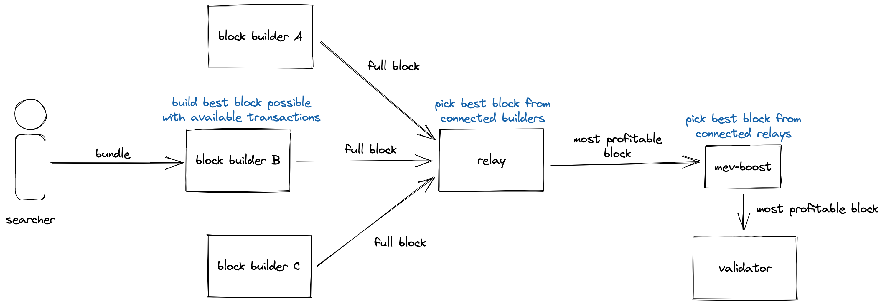
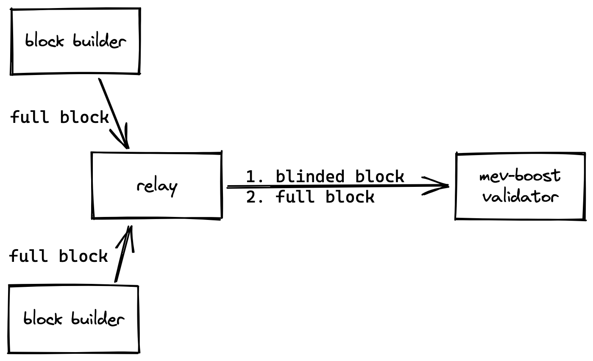

# MEV

## MEV概述
* ethereum transaction先进入mempool，后续矿工打包transaction到block，矿工收取transaction的gas和block奖励作为回报。这是一个value获取点。
* 矿工打包transaction时，可以重新排序或者插入自己有利可图的交易来获取回报。这是另一个value获取点。

前一个是用户自愿的，后一个是矿工攻击用户交易获取的。后一个就是MEV。

## pos ethereum的MEV
插入自己有利可图的交易，但交易往往有排序要求，如必须在A交易之前第一个，或者必须在A交易之后第一个，或者在A交易之前第一个并且在A交易之后第一个。我们称为一个bundler。

这里有几个问题：
* 如何发现MEV机会？
* pow的ethereum，是解决hash难题来生成block的，某个miner发现MEV机会，但并不一定是这个矿工生成block，所以他的MEV并不一定能实施。MEV的实施又变成了和pow一样的算力竞赛。算力强的矿工能获取到更大收益（多了MEV)，MEV变成了算力强大的矿工独有的游戏，这危害到ethereum社区的安全。

改进1：矿工将MEV接口开放，允许用户提交自己的MEV bundler
* 这样即使矿工自己发现的MEV，也可以向ethereum网络广播，这个MEV更有可能被包含进ethereum的block
* 有了多个MEV bundler，矿工可以根据收益情况选择接受哪些bundlers，MEV bundlers往往会支付更高的gas，以希望自己的bundler打包进block，这样矿工开放MEV接口将会获得更高的gas收益。
* 矿工不再关心如何发现MEV机会，MEV bundlers是公开的，是竞争的，MEV bundlers会支付更高的gas或者贿赂以希望打包进block，这也是矿工分享了MEV收益，以支付gas的方式。
* 寻找MEV机会的工作从矿工复杂的工作中分离出来，由searcher来寻找MEV机会，然后发送MEV bundlers给矿工，矿工就是proposer

问题：
* MEV收益肯定是大于MEV bundler支付的gas，那么矿工是否会拒绝该MEV bundler而构建属于自己的MEV bundler？
* 太多的MEV bundler提交给矿工，矿工构建block也是一个巨大的负担。

改进2：在searcher和proposer之间增加relayer，MEV bundlers提交给relayer，relayer会根据MEV bundlers构建最大化矿工收益的block并发送给proposer
* 如果发现矿工拒绝一个MEV bundler并构建了属于自己的MEV bundler，那么relayer之后拒绝发送带MEV bundlers的最大化矿工收益的block给矿工，这对矿工长期来说是个巨大损失
* relayer负责从MEV bundlers构建最大化矿工收益的block，不再是矿工。矿工只负责解决relayer给出的block的hash难题
* 如果relayer也作恶呢？relayer可以是开放的竞争的市场，用户可以去选择自己信任的relayer
* 如果有多个realyer的话，proposer可以接受到多个relayer提交的block，proposer从中选择一个收益最大的block

问题：
* relayer负责从MEV bundlers构建最大化矿工收益的block，如何构建呢？
* 在pow ethereum中，relayer可以选择不提交block给作恶的矿工，矿工算力将工作在低收益的block上，而高收益的block会被其他矿工获得，这对矿工而言是一个损失。在pos中，block不再是算力竞争出来的，而是周期指定的，ethereum网络在某个block高度是可以确定由哪个proposer生产block，relayer选择不提交block给作恶的矿工并不能惩罚矿工，因为MEV searcher是想提交MEV bundlers给这个proposer，因为有收益。relayer不提交变成了对relayer自己的惩罚。pos下的ethereum要如何解决矿工窃取用户MEV的问题呢？

## pos ethereum的MEV
在pos的ethereum，relayer不再将构建的矿工收益最大化的block直接发送给proposer，而是发送header给proposer，在得到proposer的commit后，再发送整个block给proposer。
这里有了两个角色，builder和relayer，builder只负责构建矿工收益最大化的block直接发送给relayer。relayer是builder和proposer之间的中间人，负责协调通信工作。

问题：
* 如果builder在得到proposer的commit后，但builder并不能提交整个block，这对proposer而言是一个噩耗
* 如果proposer在得到builder的整个block，构建属于自己的MEV，这对builder是一个噩耗
* builder负责从MEV bundlers构建最大化矿工收益的block，如何构建
* builder和relayer角色有什么回报，否则没人会去做
* builder和relayer可以看到用户的MEV bundlers，它们会不会作恶
* relayer连接了多少个proposer节点，连接越多的proposer，提交的block更有可能被proposer接受并进入ethereum

## relayer和proposer之间协议确保builder和proposer都是安全

## builder的功能
* 排序MEV bundlers和交易构建收益最大化的block
  * First Come First Serve
  * [first-price sealed-bid auction](https://en.wikipedia.org/wiki/First-price_sealed-bid_auction)
* 设置利益分配
  * builder将自己的地址设置为feeRecipient从而获取block的gas fee
  * builder在block中插入一个交易，支付ETH给proposer

[flashbots builder guide](https://docs.flashbots.net/flashbots-mev-boost/block-builders)
[flashbots builder source](https://github.com/flashbots/builder)

## mev-boost module in proposer

以上就是flashbots的mev实现，flashbots做到了PBS，proposer和builder分离，它是ethereum协议外的一种实现，out-protocol PBS。
out-protocol PBS有信任假设要求，需要信任builder和relayer，目前是公开且市场可竞争的，只能由用户自己去选择可信的builder和relayer。

## flashbots
* [beginners guide mev-boost](https://writings.flashbots.net/beginners-guide-mevboost/)
* [flashbots mev-boost architecture](https://docs.flashbots.net/flashbots-auction/overview)
* [why run mev-boost](https://writings.flashbots.net/why-run-mevboost/)

需要一个in-protocol PBS，这也是目前ethereum一个开发进展

## in-protocol PBS
[ethereum in-protocol PBS](https://ethresear.ch/t/proposer-block-builder-separation-friendly-fee-market-designs/9725)
