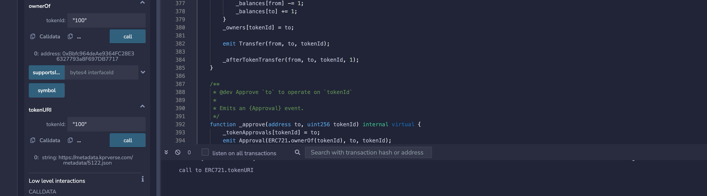

# NFT的metadata

* 在NFT中，token以token id标示，如 1、2、3......
* 每个token id有一个owner

## metadata存储

### 合约存储
```
/// @title ERC-721 Non-Fungible Token Standard, optional metadata extension
/// @dev See https://eips.ethereum.org/EIPS/eip-721
///  Note: the ERC-165 identifier for this interface is 0x5b5e139f.
interface ERC721Metadata /* is ERC721 */ {
    /// @notice A descriptive name for a collection of NFTs in this contract
    function name() external view returns (string _name);

    /// @notice An abbreviated name for NFTs in this contract
    function symbol() external view returns (string _symbol);

    /// @notice A distinct Uniform Resource Identifier (URI) for a given asset.
    /// @dev Throws if `_tokenId` is not a valid NFT. URIs are defined in RFC
    ///  3986. The URI may point to a JSON file that conforms to the "ERC721
    ///  Metadata JSON Schema".
    function tokenURI(uint256 _tokenId) external view returns (string);
}
```
tokenURI - 查询指定tokenid的metadata json链接

查询ethereum上活跃的NFT [Keepers V2](https://etherscan.io/token/0x2d33bfe1c867346543ac245396dfc6c3ebc8534f?a=2331#code).



tokenURI查询tokenid为100的NFT URI为https://metadata.kprverse.com/metadata/5122.json

### metadata json

ERC721 Metadata JSON Schema

```
{
    "title": "Asset Metadata",
    "type": "object",
    "properties": {
        "name": {
            "type": "string",
            "description": "Identifies the asset to which this NFT represents"
        },
        "description": {
            "type": "string",
            "description": "Describes the asset to which this NFT represents"
        },
        "image": {
            "type": "string",
            "description": "A URI pointing to a resource with mime type image/* representing the asset to which this NFT represents. Consider making any images at a width between 320 and 1080 pixels and aspect ratio between 1.91:1 and 4:5 inclusive."
        }
    }
}
```

keepers v2的json：

```
{
    "name":"Keeper #100",
    "description":"",
    "image":"https://metadata.kprverse.com/images/867e2065a19c4e855295e1ad4a6a902327fdd4361bdec234539250153385df77.png",
    "background_color":"788ec3",
    "external_url":"https://metadata.kprverse.com/metadata/5122.json",
    "attributes":[
        {
            "trait_type":"Ear",
            "value":"KPR Crest"
        },
        {
            "trait_type":"Entity",
            "value":"Organic"
        },
        {
            "trait_type":"Eyes",
            "value":"Damning"
        },
        {
            "trait_type":"Face",
            "value":"EMP Wiring B"
        },
        {
            "trait_type":"Hair",
            "value":"Medium Curls"
        },
        {
            "trait_type":"Headgear",
            "value":"Big Bad"
        },
        {
            "trait_type":"Innerwear",
            "value":"Nude"
        },
        {
            "trait_type":"Mouth",
            "value":"Sneer"
        },
        {
            "trait_type":"Neck",
            "value":"Tris Necklace"
        },
        {
            "trait_type":"Outerwear",
            "value":"Rider Jacket"
        },
        {
            "trait_type":"Tattoo",
            "value":"Sunburst"
        }
    ]
}
```

实际产品根据自己的需求可以填充自己想要的attributes。


