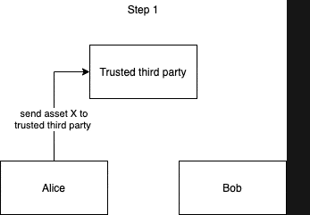
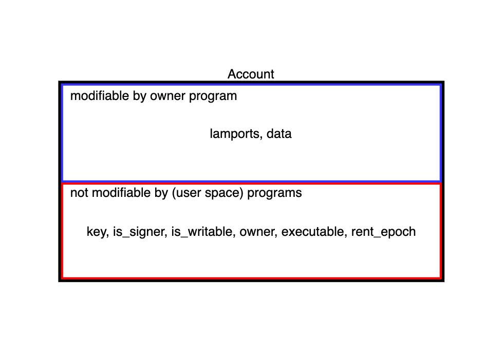
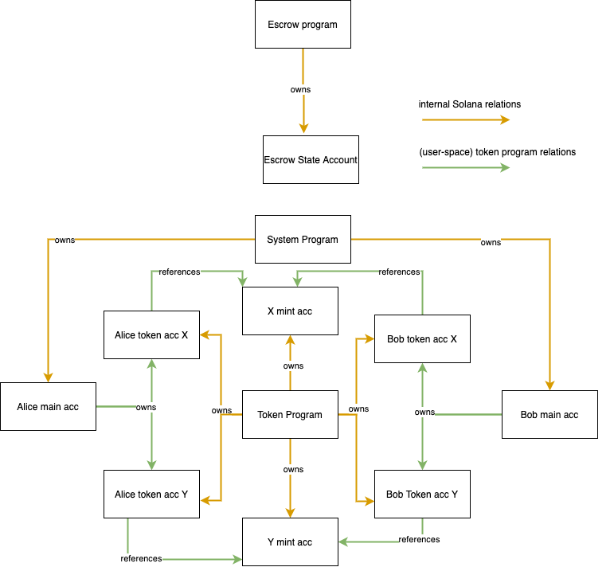

# Solana编程简介

## 背景
本指南使用一个escrow程序作为例子来介绍[Solana](https://www.solana.com)区块链编程。我们将一起一步一步的来完成代码，从而构建这个escrow程序。除了链上程序，我们还有一个用户UI，这样就可以体验我们完成的程序。我们还会用到[spl-token-ui](https://www.spl-token-ui.com/#/)。

这篇博文中的大部分内容都可以在文档或者实例程序中找到，但我还没有找到一个指南，既能一步一步地理解solana的原理，同时又能编码来实践应用。我希望这篇文章能够做到这一点，将solana的原理和应用开发结合起来。这边博文不需要你完全理解solana。开发过程中我们需要用到[Rust](https://doc.rust-lang.org/stable/book/)，同时中间也会引用到solana相关文档。

如果应用编程过程中有参考的solana原理，则以下方式插入到博文中：
```
On Solana, smart contracts are called programs
```

在每一节的末尾会有小结：

```
小结：
* 在solana中，智能合约叫program
```


这边博文并不是讲解solana，所以也不会涉及到solana所有的主题，但可以是探索solana的起点。如果你是solana和Rust的新手，并且想完整实现整个程序、完全理解文中讨论的概念和提到的链接着可能会需要一整天的时间。

如果你发现自己的程序有问题，但无法找到原因，请参考这里的[完整代码](https://github.com/paul-schaaf/solana-escrow)。

如果你发现错误或者希望提供反馈，请[twitter]()交流。

## 最终产品
在开始编码之前，我们先看看要做的最终产品是什么：escrow。

### 什么是escrow
escrow是第三方托管，它是一个很好的智能合约例子，用到了区块链的很多特性同时也易于理解。对于不熟悉这个概念的人，下面有一个简单的解释。


假设Alice有资产A，Bob有资产B，他们想要交易，但都不想先发送资产给对方，因为如果对方不继续进行交易并带走两项资产，那该怎么办！但如果任何一方都不首先发送资产，则根本无法交易。

解决这个问题的传统方法是引入A和B都信任的第三方C，一方现在可以先将他们的资产发送给C，然后C等待另一方发送资产给C，之后C再释放这两个资产给A和B。

区块链的方式是用区块链上的代码来替换被信任的第三方C，智能合约可以被审计，其行为可以与信任的第三方C相同。智能合约要比第三方C要好，原因很多，例如：第三方C可能与交易的一方串通。在智能合约中是不会出现以上问题的，因为你可以在运行代码之前检查代码。

互联网上已经有很多区块链上escrow的资料，接下来我们看看如何在solana上构建这样的第三方托管。

## 构建escrow

### 配置工程
这里有一个工程的[模版仓库](https://github.com/mvines/solana-bpf-program-template)，clone这个repo并配置。solana生态系统还很年轻，我们将使用VsCode的Rust扩展插件工具来完成我们的程序。你需要配置[Rust](https://www.rust-lang.org/tools/install)，此外你还需要配置[Solana开发工具]()。

如果你还不知道如何测试Solana程序，请删除所有的测试代码，测试程序会有另一篇博文。删除lib.rs中的测试代码以及src旁边的tests文件夹。最后，从[Cargo.toml](https://doc.rust-lang.org/book/ch01-03-hello-cargo.html?highlight=cargo#creating-a-project-with-cargo)中删除测试依赖性，现在应该是这样的：
```
[package]
name = "solana-escrow"
version = "0.1.0"
edition = "2018"
license = "WTFPL"
publish = false

[dependencies]
solana-program = "1.6.9"

[lib]
crate-type = ["cdylib", "lib"]
```

### entrypoint.rs, programs and accounts
看看lib.rs，首先，使用[use](https://doc.rust-lang.org/stable/book/ch07-04-bringing-paths-into-scope-with-the-use-keyword.html)将需要用的[crates](https://doc.rust-lang.org/book/ch07-01-packages-and-crates.html)模块标识符引入到当前作用域。之后使用entrypoint! [macro](https://doc.rust-lang.org/stable/book/ch19-06-macros.html)来定义process_instruction函数为程序的[entrypoint](https://docs.solana.com/developing/on-chain-programs/developing-rust#program-entrypoint)。执行程序的唯一入口是entrypoint，所有的调用都通过entrypoint进行。
```
When called, a program is passed to its BPF Loader which processes the call. Different BPF loaders may require different entrypoints.
```

solana有BPF加载程序，存在加载程序的原因是我们的智能合约本身就是一个程序。如果对程序进行了更新，则必须部署程序的新版本。我们正在使用的BPF加载程序需要entrypoint函数接受三个参数。program_id是当前执行程序的程序id。你有可能会在程序中使用它，原因稍后就会看到。instruct_data是调用者传递给程序的数据，它可以是任何东西。最后还有账户，但要理解账户，就需要先深入理解[solana编程模型](https://docs.solana.com/developing/programming-model/overview)。执行智能合约还需要提供账户的原因是：
```
Solana programs are stateless
```

如果要存储状态数据，就需要使用[accounts](https://docs.solana.com/developing/programming-model/accounts)。程序本身也存储在被标记为executable的账户中，每个账户可以保存数据或者SOL，每个账户也有一个owner，只有owner才可以在账户上做借出和修改账户数据，任何人都可以在账户上做存入。下面是一个[账户](https://explorer.solana.com/address/6TkKqq15wXjqEjNg9zqTKADwuVATR9dW3rkNnsYme1ea)示例，正如在示例账户中看到的，该账户的owner被设置为System Program。
```
Accounts can only be owned by programs
```

这时你可能会想，“这是否意味着我自己的SOL账户实际上不是我自己所有？”。这是对的！但你的资金是安全的。在solana，即使是基本的SOL转账交易，也是由solana上的一个程序处理：System Program。（事实上，程序的owner也是程序，程序也是存储在账户中，这些可执行的账户的owner是BPF加载程序，BPF是所有程序的owner，除了BPF加载程序本身和System Program，他们的owner是NativeLoader，具有一些特权，如分配内存、标记一个账户为executable)。


如果你[查看System Program](https://github.com/solana-labs/solana/blob/master/runtime/src/system_instruction_processor.rs#L179)，你会看到，尽管该程序拥有所有的SOL账户，但它只能在交易由借出的SOL账户签名后才能从借出账户转移SOL。

```
In theory, programs have full autonomy over the accounts they own. It is up to the program's creator to limit this autonomy and up to the users of the program to verify the program's creator has really done so
```

我们将了解程序如何检查交易是否已签名，以及程序如何在一段时间内成为账户的owner。

```
All accounts to be read or written to must be passed into the entrypoint function
```

这将允许solana并行处理交易，如果运行时知道所有交易在什么时候将写入或者读取的各个账户，solana可以并行运行那些账户写入不冲突或者并行运行账户只读不写的多个交易。如果交易读取或者写入未传入的账户，则交易会失败。

我们在lib.rs旁边创建一个新的entrypoint.rs文件，并将lib.rs代码移到entrypoint.rs，最后在lib.rs中注册entrypoint模块，在后面的过程中，需要对我们创建的所有程序文件执行模块注册。

```
// inside lib.rs, only the following line should be in here
pub mod entrypoint;
```

### 小结

* 每个program都由BPF Loader处理，只有一个entrypoint
* account用来存储状态
* account的owner是program
* 只有账户owner可以借出账户并修改数据
* 所有要写入或者读取的account都必须加入到entrypoint的accounts参数

### instruction.rs Part 1, general code structure, and the beginning of the escrow program flow

#### code structure
接下来，在两个文件旁边创建文件instruction.rs，并在lib.rs中注册模块。为了理解文件的用途，我们先看一看程序的代码结构和执行逻辑。

```
.
├─ src
│  ├─ lib.rs -> registering modules
│  ├─ entrypoint.rs -> entrypoint to the program
│  ├─ instruction.rs -> program API, (de)serializing instruction data
│  ├─ processor.rs -> program logic
│  ├─ state.rs -> program objects, (de)serializing state
│  ├─ error.rs -> program specific errors
├─ .gitignore
├─ Cargo.lock
├─ Cargo.toml
├─ Xargo.toml
```

这个程序的代码结构和逻辑流程如下：
* 有一个程序入口entrypoint
* entrypoint将参数转发给processor
* processor请求instruction.rs解码instruct_data参数
* processor根据解码的参数数据，决定调用那个处理函数
* processor使用state.rs encode或者decode状态数据

```
instruction.rs defines the "API" of a program
```

程序只有一个entrypoint，但根据instruction.rs中decode的instruction_data，可以执行不同的功能。

#### beginning of the escrow program flow

我们下来细化并制定escrow程序功能和运行逻辑。我们有两个参与方Alice和Bob，这意味着有两个system_program账户。因为Alice和Bob想转移token，我们需要token program。在token program中，要持有token，你需要一个token account，Alice和Bob都需要每个token的一个账户（我们称为token X和token Y），因此我们又有了4个账户。由于托管发起和token交易不会在一次交易中发生，因此使用另一个托管账户来保存托管数据（账户将存储一方想要多少Y token来交换另一方的X token，这些后面会讨论）。程序的结构如下：


这里有两个问题：
* Alice和Bob如何将token X和Y的所有权转让给托管账户
* Alice和Bob的main account如何和token account关联

要找到这些问题的答案，我们就要进入token program。

### The token program Part 1

#### token ownership

将Alice的main account连接到她的token account的简单方法是根本不连接它们，每当Alice想要转移token时，她都会使用token account的私钥，显然，如果Alice拥有许多token，这将有问题，因为这需要她为每个token account保存一个私钥。

如果Alice的所有token account都有一个私钥，这对她来说就容易多了，token program就是这样做的。token program为每个token account分配一个owner，但注意，这里token account的owner属性与账户owner不同，账户owner是solana内部属性，它始终是一个program，这里的token acount的owner属性是token program在用户空间（程序自己的空间）声明的属性，它和一些[其他属性](https://github.com/solana-labs/solana-program-library/blob/80e29ef6b9a081d457849a2ca42db50d7da0e37e/token/program/src/state.rs#L86)被写入到token account数据中，比如还有账户持有的token amount等。这也意味着，一旦创建了token account，他的私钥就没用了，只有owner了，owner属性就是其他地址，在这里，就是Alice的main account。在进行token转账时，只需要使用main account的私钥在交易上签名。

```
All internal Solana internal account information are saved into fields on the account (opens new window) but never into the data field which is solely meant for user space information
```


我们可以在[浏览器](https://explorer.solana.com/address/EzMCP3PVVkZD4YFXhJNKhgwMihuxxeFqH4F6uPxFxFAe)中查看token account的各个属性，浏览器解析了账户的数据属性，并显示格式正确的用户空间字段。

在浏览器上还有一个mint字段，这样我们就知道token account属于哪个token program，对于每个token，都有一个mint account，用于保存token的metadata，例如：总供应量。在后续可以看到，我们将需要此字段来验证Alice和Bob使用的token account是否真正属于token X或者Y，以确保没有执行错误的token。

程序结构现在如下：


现在我们已经知道了这些账户是如何链接的，但我们还不知道Alice如何将token转移到托管账户，下面开始讨论这个问题。

#### transferring ownership

拥有token的唯一方法是拥有一个token account，该account持有account mint属性引用的token的余额，因此，escrow program需要一个账户来持有Alice的X token，实现这一点的一种方法是让Alice创建一个临时的X token account，Alice将想要交易的X token转移到该账户（token program不限制token account数量），然后，使用token program中一个函数，将临时X token account的owner转给escrow program。我们现在将临时账户添加到escrow程序结构中，以下显示了Alice转移临时token account的owner之前的结构：


这里还有一个问题，Alice到底将临时token account的owner转给了什么？参考[Program Derived Address](https://docs.solana.com/developing/programming-model/calling-between-programs#program-derived-addresses)

### 小结
* 开发者应该使用账户的data字段在账户内保存数据
* token program拥有token account，该account在其data字段内保存[相关信息](https://github.com/solana-labs/solana-program-library/blob/master/token/program/src/state.rs#L86)
*  token program还拥有mint账户，保存[相关数据](https://github.com/solana-labs/solana-program-library/blob/master/token/program/src/state.rs#L86)
* 每个token account有其token的mint account，用来说明它们属于那个token
* token program允许token account的owner将其所有权转移给另一个地址
* 所有内部账户信息都会保存在[账户的字段](https://docs.rs/solana-program/1.5.0/solana_program/account_info/struct.AccountInfo.html#fields)中，但不会保存到仅用于用户空间信息的data字段中

### Program Derived Addresses(PDAs) Part 1
我们让escrow program在开始托管并等待另一方交易时拥有了X token，那么，program是否可以获得该token account的用户空间所有权？


诀窍是将该token account的所有权分配给escrow program的Program Derived Address（PDA），现在，只需要知道这个地址存在就够了，我们可以使用它让程序签名交易或者为其分配账户的用户空间所有权，在后面会深入讨论PDA，现在先回到代码！

### instruction.rs Part 2
instruction.rs文件将定义program的API，但目前还没有编写任何代码，我们从添加InitEscrow API开始编码。

```
// inside instruction.rs
pub enum EscrowInstruction {

    /// Starts the trade by creating and populating an escrow account and transferring ownership of the given temp token account to the PDA
    ///
    ///
    /// Accounts expected:
    ///
    /// 0. `[signer]` The account of the person initializing the escrow
    /// 1. `[writable]` Temporary token account that should be created prior to this instruction and owned by the initializer
    /// 2. `[]` The initializer's token account for the token they will receive should the trade go through
    /// 3. `[writable]` The escrow account, it will hold all necessary info about the trade.
    /// 4. `[]` The rent sysvar
    /// 5. `[]` The token program
    InitEscrow {
        /// The amount party A expects to receive of token Y
        amount: u64
    }
}
```

尽管instruction.rs不涉及到账户，但在此处定义我们希望使用的账户是很有帮助的，这样所有必需的传入信息都在一个地方，其他人也可以轻松找到。此外，在括号内添加所需的账户属性也很有帮助。但注意///之后的所有内容都是注释，对程序没有影响，它仅用于文档目的。要注意可写属性，这与上面解释的执行并行化有关，如果调用方没有在其调用代码中标记账户为可写，但程序尝试写入，则交易失败。

```
0. `[signer]` The account of the person initializing the escrow
```
我们需要账户0，账户0是签名者，因为转移临时token account的所有权需要Alice的签名，我会将Alice称为代码的初始值设定者，Bob称为代码的接受者（Alice初始化escrow，Bob接受交易）。

```
1. `[writable]` Temporary token account that should be created prior to this instruction and owned by the initializer
```
账户1是需要可写的临时token X账户，这是因为要更改token account的所有权，这需要在用户空间更改，意味着账户的data字段将被更改。

```
2. `[]` The initializer's token account for the token they will receive should the trade go through
```
账户2是Alice的token Y账户，虽然它最终会被更改，但不会发生在这个交易中，这就是为什么我们可以将括号留空，意味着只读。

```
3. `[writable]` The escrow account, it will hold all necessary info about the trade.
```
账户3是escrow account，他也需要可写，因为program将把托管信息写入其中。

```
4. `[]` The rent sysvar
```
账户4时Rent系统变量，在开始编写process代码时，会详细解释。

```
5. `[]` The token program
```
账户5时token program本身的账户，当我们开始后编写process代码时，会解释为什么我们也需要这个账户。


```
InitEscrow {
    /// The amount party A expects to receive of token Y
    amount: u64
}
```

最后，escrow program需要Alice希望为她的token X需要支付的token Y的数量，该金额不是通过账号提供的，而是通过instruct_data提供的。

instruction.rs负责decode instruction_data，我们接下来实现。

```
// inside instruction.rs
use std::convert::TryInto;
use solana_program::program_error::ProgramError;

use crate::error::EscrowError::InvalidInstruction;

 pub enum EscrowInstruction {

    /// Starts the trade by creating and populating an escrow account and transferring ownership of the given temp token account to the PDA
    ///
    ///
    /// Accounts expected:
    ///
    /// 0. `[signer]` The account of the person initializing the escrow
    /// 1. `[writable]` Temporary token account that should be created prior to this instruction and owned by the initializer
    /// 2. `[]` The initializer's token account for the token they will receive should the trade go through
    /// 3. `[writable]` The escrow account, it will hold all necessary info about the trade.
    /// 4. `[]` The rent sysvar
    /// 5. `[]` The token program
    InitEscrow {
        /// The amount party A expects to receive of token Y
        amount: u64
    }
}

impl EscrowInstruction {
    /// Unpacks a byte buffer into a [EscrowInstruction](enum.EscrowInstruction.html).
    pub fn unpack(input: &[u8]) -> Result<Self, ProgramError> {
        let (tag, rest) = input.split_first().ok_or(InvalidInstruction)?;

        Ok(match tag {
            0 => Self::InitEscrow {
                amount: Self::unpack_amount(rest)?,
            },
            _ => return Err(InvalidInstruction.into()),
        })
    }

    fn unpack_amount(input: &[u8]) -> Result<u64, ProgramError> {
        let amount = input
            .get(..8)
            .and_then(|slice| slice.try_into().ok())
            .map(u64::from_le_bytes)
            .ok_or(InvalidInstruction)?;
        Ok(amount)
    }
}
```

unpack需要一个对u8 slice的[引用](https://doc.rust-lang.org/stable/book/ch04-02-references-and-borrowing.html)，它检查第一个字节（=tag）以确定如何decode（使用[match](https://doc.rust-lang.org/rust-by-example/flow_control/match.html)）剩余的字节（=rest），现在，我们将把它保留在一个instruction上（先忽略Bob进行交易的instruction）。

unpack_amount对剩余部分进行decode，以获得表示金额的u64，你可以自己查找各个函数，现在最重要的是，你要了解unpack函数的高级功能：1、选择要生成的instruction，2、生成并返回该instruction。

这将无法build，因为我们正在使用未定义的error，接下来，让我们编写该error。

### error.rs
在其他文件旁边再创建一个新文件error.rs，并将其注册到lib.rs中，然后，将以下依赖项添加到Cargo.toml中。

```
...
[dependencies]
solana-program = "1.6.9"
thiserror = "1.0.24"
```

然后在error.rs中添加如下代码：
```
// inside error.rs
use thiserror::Error;

#[derive(Error, Debug, Copy, Clone)]
pub enum EscrowError {
    /// Invalid instruction
    #[error("Invalid Instruction")]
    InvalidInstruction,
}
1
```
我们在这里做的是[定义错误类型](https://doc.rust-lang.org/rust-by-example/error/multiple_error_types/define_error_type.html)，我们没有像链接指向的示例中那样编写自己的fmt::Display实现，而是使用方便的[thiserror](https://doc.rust-lang.org/rust-by-example/error/multiple_error_types/define_error_type.html)库，它使用[#[error("...")]](https://doc.rust-lang.org/book/ch19-06-macros.html?highlight=derive#how-to-write-a-custom-derive-macro)表示法为我们完成工作，当我们后面添加更多错误时，这变得特别有用。

回顾instruction.rs，可以看到我们还没有完全完成，编译器告诉我，它无法将EscrowError转换为ProgramError（“the trait std::convert::From<error::EscrowError> is not implemented for solana_program::program_error::ProgramError"）。我们还需要实现这个方法。

```
// inside error.rs
use thiserror::Error;

use solana_program::program_error::ProgramError;

#[derive(Error, Debug, Copy, Clone)]
pub enum EscrowError {
    /// Invalid instruction
    #[error("Invalid Instruction")]
    InvalidInstruction,
}

impl From<EscrowError> for ProgramError {
    fn from(e: EscrowError) -> Self {
        ProgramError::Custom(e as u32)
    }
}
```

我们需要看看这里发生了什么，我们实现了一个generic trait，?操作符需要使用[From](https://doc.rust-lang.org/std/convert/trait.From.html) trait。为了实现这个trait，我们必须实现执行转换的from函数。ProgramError枚举了自定义的变量，允许我们将程序的错误转换为ProgramError。

我们要进行这种转换的原因是entrypoint返回的Result要么是nothing，要么是ProgramError。

### processor.rs Part 1, Rent Part 1, starting to process the InitEscrow instruction

#### pub fn process
在编码entrpoint、InitSecrow和error后，我们开始编码processor.rs，这里是程序的主要逻辑，我们首先创建processor.rs并在lib.rs中注册它，然后编写如下代码：

```
use solana_program::{
    account_info::AccountInfo,
    entrypoint::ProgramResult,
    msg,
    pubkey::Pubkey,
};

use crate::instruction::EscrowInstruction;

pub struct Processor;
impl Processor {
    pub fn process(program_id: &Pubkey, accounts: &[AccountInfo], instruction_data: &[u8]) -> ProgramResult {
        let instruction = EscrowInstruction::unpack(instruction_data)?;

        match instruction {
            EscrowInstruction::InitEscrow { amount } => {
                msg!("Instruction: InitEscrow");
                Self::process_init_escrow(accounts, amount, program_id)
            }
        }
    }
}
```
我们先看看上面的程序，首先，我们对entrypoint.rs中的instruction_data切片引用传递到前面创建的unpack函数中（注意函数调用后的[?](https://doc.rust-lang.org/book/ch09-02-recoverable-errors-with-result.html?highlight=question,mark#a-shortcut-for-propagating-errors-the--operator)），我们使用match来确定要调用哪个处理函数。通过msg!记录程序执行过程。

#### fn process_init_escrow
```
use solana_program::{
    account_info::{next_account_info, AccountInfo},
    entrypoint::ProgramResult,
    program_error::ProgramError,
    msg,
    pubkey::Pubkey,
};
...
impl Processor {
    pub fn process{...}
    
    fn process_init_escrow(
        accounts: &[AccountInfo],
        amount: u64,
        program_id: &Pubkey,
    ) -> ProgramResult {
        let account_info_iter = &mut accounts.iter();
        let initializer = next_account_info(account_info_iter)?;

        if !initializer.is_signer {
            return Err(ProgramError::MissingRequiredSignature);
        }

        Ok(())
    }
}
```

这里是process_init_escrow代码，我们首先创建了一个账户迭代器，它需要是mute，这样我们就可以从中去掉元素，我们期望的第一个账户是escrow的初始人，也就是Alice的main account，它需要签名，我们马上检查，签名只是AccountInfo上的一个bool字段。

```
...
fn process_init_escrow(
    accounts: &[AccountInfo],
    amount: u64,
    program_id: &Pubkey,
) -> ProgramResult {
    let account_info_iter = &mut accounts.iter();
    let initializer = next_account_info(account_info_iter)?;

    if !initializer.is_signer {
        return Err(ProgramError::MissingRequiredSignature);
    }

    let temp_token_account = next_account_info(account_info_iter)?;

    let token_to_receive_account = next_account_info(account_info_iter)?;
    if *token_to_receive_account.owner != spl_token::id() {
        return Err(ProgramError::IncorrectProgramId);
    }

    Ok(())
}
...
```

接下来，临时token account需要可写，但无需显示检查，如果Alice不将账户标记为可写，则交易将自动失败。你可能会觉得奇怪，为什么我们要检查token_to_receive_account确实被token program拥有，但不检查temp_token_account！答案是在稍后的函数中，我们将要求token program将临时token account的owner转移给PDA，如果临时token account不属于token program，则此交易将失败，因为只有拥有账户的program才能更改账户，因此，我们没有必要在这里添加检查。

不过我们不会对token_to_receive_account进行任何的修改（在Alice交易中）,我们只需将其保存到escrow数据中，这样当Bob进行交易时，escrow将知道向何处发送token Y，因此，对于此账户，我们应该添加一个检查，如果我们不这样做，就不会发生什么可怕的事情，与Alice的交易因我们添加的检查而失败不同，Bob的交易将失败，因为token program将尝试向Alice发送token Y，但不是token_to_receiver_account的owner，这就是说，让交易失败实际上比导致无效状态似乎更合理。

最后，你可能已经注意到，我们在这里使用的crate还没有注册到Cargo.toml中。

```
[dependencies]
solana-program = "1.6.9"
thiserror = "1.0.24"
spl-token = {version = "3.1.1", features = ["no-entrypoint"]}
```

我们在这里使用的导入依赖项的方式与导入其他依赖项的方式略有不同，这是因为我们正在导入另一个具有自己entrypoint的solana程序，但是我们的程序应该只有一个entrypoint，即我们前面定义的entrypoint，幸运的是，token program提供了一个开关，可以在[Cargo功能](https://doc.rust-lang.org/cargo/reference/features.html)的帮助下关闭起entrypoint，我们应该在我们的程序中定义此功能，以便其他人可以导入我们的程序！我将给一些提示：查看[token program](https://github.com/solana-labs/solana-program-library/tree/master/token/program)的Cargo.toml及其lib.rs。如果不知道怎么解决这个问题，你可以看看最终的escrow程序。

回到processor.rs，复制并替换solana_program的use语句并添加更多的代码到process_init_escrow:
```
use solana_program::{
    account_info::{next_account_info, AccountInfo},
    entrypoint::ProgramResult,
    program_error::ProgramError,
    msg,
    pubkey::Pubkey,
    program_pack::{Pack, IsInitialized},
    sysvar::{rent::Rent, Sysvar},
};
//inside process_init_escrow
...
let temp_token_account = next_account_info(account_info_iter)?;

let token_to_receive_account = next_account_info(account_info_iter)?;
if *token_to_receive_account.owner != spl_token::id() {
    return Err(ProgramError::IncorrectProgramId);
}

let escrow_account = next_account_info(account_info_iter)?;
let rent = &Rent::from_account_info(next_account_info(account_info_iter)?)?;

if !rent.is_exempt(escrow_account.lamports(), escrow_account.data_len()) {
    return Err(EscrowError::NotRentExempt.into());
}

let mut escrow_info = Escrow::unpack_unchecked(&escrow_account.data.borrow())?;
if escrow_info.is_initialized() {
    return Err(ProgramError::AccountAlreadyInitialized);
}

Ok(())
...
```
大多数时候，你希望你的账户免收租金，因为一旦余额为0，他就会消失，更多的解释会在结尾。

另外，确保在error.rs中添加了新的错误变量，并调整了use语句：

```
old
use crate::instruction::EscrowInstruction;

new
use crate::{instruction::EscrowInstruction, error::EscrowError};
```

接下来我们需要访问data字段，因为数据也是u8的一个数组，所以我们需要使用Escrow::unpack_unchecked对其进行反序列化，这是state.rs中的一个函数，我们在后面就创建它。

### state.rs


